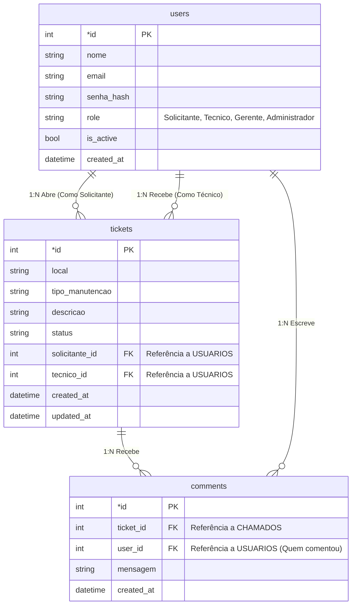

```mermaid
erDiagram

    users ||--o{ tickets : "1:N Abre (Como Solicitante)"

    users ||--o{ tickets : "1:N Recebe (Como Técnico)"

    tickets ||--o{ comments : "1:N Recebe"

    users ||--o{ comments : "1:N Escreve"

  

    users {

        int *id PK

        string nome

        string email

        string senha_hash

        string role "Solicitante, Tecnico, Gerente, Administrador"

        bool is_active

        datetime created_at

    }

  

    tickets {

        int *id PK

        string local

        string tipo_manutencao

        string descricao

        string status

        int solicitante_id FK "Referência a USUARIOS"

        int tecnico_id FK "Referência a USUARIOS"

        datetime created_at

        datetime updated_at

    }

  

    comments {

        int *id PK

        int ticket_id FK "Referência a CHAMADOS"

        int user_id FK "Referência a USUARIOS (Quem comentou)"

        string mensagem

        datetime created_at

    }
```

PK (Primary Key): Identificador único de cada registro na tabela.

FK (Foreign Key): Referência ao identificador de outra tabela (cria o relacionamento).