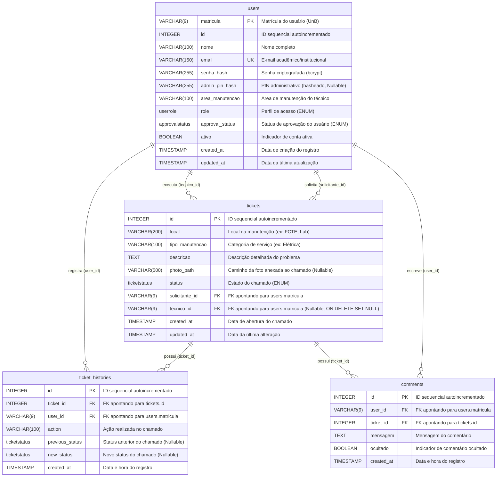

# Visão Geral do Banco de Dados (KeepUnB)

Este documento descreve a arquitetura, o modelo de dados físico e as diretrizes de governança para o banco de dados relacional (**PostgreSQL 16+**) do sistema **KeepUnB**, mapeado através do ORM **SQLAlchemy 2.x** e gerenciado via **Alembic**.

---

## 1. Diagrama Entidade-Relacionamento (ERD)

Abaixo está a representação visual da modelagem física inicial do banco de dados, mostrando as relações e chaves estrangeiras entre a tabela de usuários (`users`) e a tabela de chamados/solicitações de manutenção (`tickets`).



---

## 2. Dicionário de Dados

### 2.1 Tabela `users`
Armazena as credenciais, perfis de acesso e dados cadastrais dos quatro tipos de usuários atendidos pela plataforma KeepUnB.

| Nome da Coluna | Tipo de Dado | Restrições | Padrão (Default) | Descrição |
| :--- | :--- | :--- | :--- | :--- |
| **`matricula`** | `VARCHAR(9)` | `PRIMARY KEY`, `CHECK` | *Nenhum* | Matrícula acadêmica do usuário (estudante/servidor). Deve possuir exatamente 9 dígitos numéricos. |
| **`id`** | `INTEGER` | `NOT NULL`, `INDEX` | *Nenhum* | ID sequencial autoincrementado utilizando o *Identity(always=True)* para impedir intervenção externa |
| **`nome`** | `VARCHAR(100)` | `NOT NULL` | *Nenhum* | Nome completo do usuário. |
| **`email`** | `VARCHAR(150)` | `UNIQUE`, `NOT NULL`, `INDEX` | *Nenhum* | Endereço de e-mail institucional/pessoal (chave de login alternativa). |
| **`senha_hash`** | `VARCHAR(255)` | `NOT NULL` | *Nenhum* | Hash seguro da senha gerado utilizando o algoritmo **bcrypt**. |
| **`admin_pin_hash`** | `VARCHAR(255)` | *Nenhum* | `NULL` | Hash seguro do PIN do administrador (hasheado). Nullable para outros perfis. |
| **`area_manutencao`** | `VARCHAR(100)` | *Nenhum* | `NULL` | Área de manutenção designada ao técnico |
| **`role`** | `userrole` (ENUM) | `NOT NULL` | `'SOLICITANTE'` | Perfil de permissão e privilégios de acesso do usuário no sistema. |
| **`approval_status`** | `approvalstatus` (ENUM) | `NOT NULL` | `'PENDENTE'` | Define o status de aprovação do usuário (APROVADO, PENDENTE, REPROVADO). |
| **`ativo`** | `BOOLEAN` | `NOT NULL` | `true` | Define se a conta está ativa e com permissão para realizar login. |
| **`created_at`** | `TIMESTAMP WITH TIME ZONE` | `NOT NULL` | `now()` | Registro de data/hora em que a conta do usuário foi cadastrada. |
| **`updated_at`** | `TIMESTAMP WITH TIME ZONE` | `NOT NULL` | `now()` | Registro de data/hora da última alteração no cadastro do usuário. |

> [!NOTE]
> A constraint de validação **`ck_users_matricula_9_digitos`** assegura via banco que o valor inserido na coluna `matricula` satisfaz a expressão regular `^[0-9]{9}$`.

---

### 2.2 Tabela `tickets`
Centraliza as solicitações de manutenção de infraestrutura abertas pela comunidade acadêmica e monitoradas pelos técnicos e gerentes.

| Nome da Coluna | Tipo de Dado | Restrições | Padrão (Default) | Descrição |
| :--- | :--- | :--- | :--- | :--- |
| **`id`** | `INTEGER` | `PRIMARY KEY`, `INDEX`, `AUTOINCREMENT` | *Nenhum* | ID autoincrementado gerado sequencialmente pelo PostgreSQL para identificação única do ticket. |
| **`local`** | `VARCHAR(200)` | `NOT NULL` | *Nenhum* | Espaço físico ou sala onde a manutenção é necessária (ex: "FCTE - Bloco A - Sala A1-12"). |
| **`tipo_manutencao`** | `VARCHAR(100)` | `NOT NULL` | *Nenhum* | Categoria ou especialidade do reparo solicitado (ex: "Elétrica", "Hidráulica", "Ar condicionado"). |
| **`descricao`** | `TEXT` | `NOT NULL` | *Nenhum* | Texto detalhado enviado pelo solicitante relatando a anomalia ou problema. |
| **`status`** | `ticketstatus` (ENUM) | `NOT NULL` | `'ABERTO'` | Status do ciclo de vida em que o chamado se encontra. |
| **`solicitante_id`** | `VARCHAR(9)` | `FOREIGN KEY` (`users.matricula`), `NOT NULL` | *Nenhum* | Matrícula do usuário solicitante (autor da abertura do ticket). |
| **`tecnico_id`** | `VARCHAR(9)` | `FOREIGN KEY` (`users.matricula`), `NULLABLE`, `ON DELETE SET NULL` | `NULL` | Matrícula do técnico encarregado de executar a manutenção. Se o técnico for excluído do banco, o chamado é automaticamente desatribuído (retorna para NULL). |
| **`photo_path`** | `VARCHAR(500)` | *Nenhum* | `NULL` | Caminho do arquivo da foto anexada à solicitação de manutenção. |
| **`created_at`** | `TIMESTAMP WITH TIME ZONE` | `NOT NULL` | `now()` | Registro de data/hora em que o chamado de manutenção foi formalizado. |
| **`updated_at`** | `TIMESTAMP WITH TIME ZONE` | `NOT NULL` | `now()` | Registro de data/hora da última alteração no ciclo de vida ou detalhes do chamado. |

> [!IMPORTANT]
> As chaves estrangeiras (`FK`) nesta tabela seguem rigidamente a convenção do projeto de serem explicitamente nomeadas no banco de dados como:
> - **`fk_tickets_solicitante_users`** apontando para `users.matricula`.
> - **`fk_tickets_tecnico_users`** apontando para `users.matricula` (configurada com a diretiva `ON DELETE SET NULL`).
> 
> **Nota de Deleção Física (Usuário Sentinela):** Ao realizar a exclusão de qualquer usuário que possua tickets cadastrados como solicitante, o backend reatribui previamente a FK `solicitante_id` para o usuário sentinela `"000000000"` ("Usuário Excluído") a fim de preservar a integridade dos dados antes da remoção física.

---

### 2.3 Tabela `ticket_histories`
Armazena o registro histórico de todas as alterações e ações críticas realizadas sobre os chamados do sistema (logs de auditoria).

| Nome da Coluna | Tipo de Dado | Restrições | Padrão (Default) | Descrição |
| :--- | :--- | :--- | :--- | :--- |
| **`id`** | `INTEGER` | `PRIMARY KEY`, `INDEX`, `AUTOINCREMENT` | *Nenhum* | ID autoincrementado gerado sequencialmente pelo PostgreSQL para identificação única do log de histórico. |
| **`ticket_id`** | `INTEGER` | `FOREIGN KEY` (`tickets.id`), `NOT NULL` | *Nenhum* | ID do chamado associado à alteração registrada. |
| **`user_id`** | `VARCHAR(9)` | `FOREIGN KEY` (`users.matricula`), `NOT NULL` | *Nenhum* | Matrícula do usuário responsável por executar a ação que gerou o log. |
| **`action`** | `VARCHAR(100)` | `NOT NULL` | *Nenhum* | Texto descritivo da ação realizada (ex: "Chamado criado", "Técnico atribuído"). |
| **`previous_status`** | `ticketstatus` (ENUM) | `NULLABLE` | `NULL` | Status anterior do chamado, caso a ação tenha provocado mudança de estado. |
| **`new_status`** | `ticketstatus` (ENUM) | `NULLABLE` | `NULL` | Novo status do chamado, caso a ação tenha provocado mudança de estado. |
| **`created_at`** | `TIMESTAMP WITH TIME ZONE` | `NOT NULL` | `now()` | Registro de data e hora em que a ação de histórico foi registrada. |

> [!IMPORTANT]
> As chaves estrangeiras (`FK`) nesta tabela seguem rigidamente a convenção do projeto de serem explicitamente nomeadas no banco de dados como:
> - **`fk_ticket_histories_tickets`** apontando para `tickets.id`.
> - **`fk_ticket_histories_users`** apontando para `users.matricula`.
> 
> **Nota de Deleção Física (Usuário Sentinela):** Se um usuário que possui registros históricos de chamados vinculados for deletado fisicamente do banco de dados, as ocorrências correspondentes em `user_id` são migradas programaticamente no backend para a conta sentinela `"000000000"`.

---

### 2.4 Tabela `comments`
Armazena comentários e observações adicionados por usuários e técnicos em chamados específicos.

| Nome da Coluna | Tipo de Dado | Restrições | Padrão (Default) | Descrição |
| :--- | :--- | :--- | :--- | :--- |
| **`id`** | `INTEGER` | `PRIMARY KEY`, `INDEX`, `AUTOINCREMENT` | *Nenhum* | ID autoincrementado gerado sequencialmente pelo PostgreSQL para identificação única do comentário. |
| **`user_id`** | `VARCHAR(9)` | `FOREIGN KEY` (`users.matricula`), `NOT NULL` | *Nenhum* | Matrícula do usuário autor do comentário. |
| **`ticket_id`** | `INTEGER` | `FOREIGN KEY` (`tickets.id`), `NOT NULL` | *Nenhum* | ID do chamado associado ao comentário. |
| **`mensagem`** | `TEXT` | `NOT NULL` | *Nenhum* | Conteúdo textual do comentário. |
| **`ocultado`** | `BOOLEAN` | `NOT NULL` | `false` | Define se o comentário está ocultado (para moderação de conteúdo impróprio). |
| **`created_at`** | `TIMESTAMP WITH TIME ZONE` | `NOT NULL` | `now()` | Registro de data/hora em que o comentário foi postado. |

> [!IMPORTANT]
> As chaves estrangeiras (`FK`) nesta tabela foram criadas de forma implícita e apontam para:
> - `user_id` apontando para `users.matricula`.
> - `ticket_id` apontando para `tickets.id`.
> 
> **Nota de Deleção Física (Usuário Sentinela):** Se o autor de um comentário for excluído do sistema, o backend migra a chave estrangeira `user_id` do comentário para a conta sentinela `"000000000"` antes de efetuar a remoção do usuário do banco de dados.

---

## 3. Tipos Customizados (ENUMs)

Para garantir consistência e integridade referencial nas regras de negócios, o PostgreSQL gerencia dois tipo estruturados de ENUMs:

### 3.1 `userrole`
Especifica o nível de autorização e o escopo de atuação do usuário dentro do ecossistema:
- **`SOLICITANTE`**: Alunos, professores ou servidores. Podem abrir chamados, acompanhar suas próprias solicitações e avaliá-las após a conclusão.
- **`TECNICO`**: Profissionais da manutenção encarregados de realizar o serviço de reparo, movimentar o status dos chamados atribuídos e listar a fila pendente.
- **`GERENTE`**: Administradores operacionais com poder de visualização global, delegação/atribuição de chamados para técnicos e emissão de relatórios de SLA.
- **`ADMIN`**: Administradores técnicos focados no gerenciamento de contas, perfis de segurança e parâmetros transversais do sistema.

### 3.2 `ticketstatus`
Define as etapas sequenciais do fluxo de trabalho e atendimento das demandas de infraestrutura:
- **`ABERTO`**: Chamado recém-criado pelo solicitante, aguardando triagem ou atribuição de responsável.
- **`ATRIBUIDO`**: Técnico associado pelo gerente ou auto-atribuído, aguardando início da execução prática.
- **`EM_ANDAMENTO`**: O técnico iniciou ativamente as tarefas de reparação física no local indicado.
- **`CONCLUIDO`**: Manutenção executada e finalizada com sucesso. O chamado é movido para etapa de avaliação.
- **`CANCELADO`**: Chamado arquivado por duplicidade, erro de dados ou solicitação do autor antes da execução.
- **`NAO_INICIADO`**: Estado neutro/histórico para chamados que aguardam agendamento prévio ou liberação de insumos.

### 3.3 `approvalstatus`
Controla o fluxo de aceitação e aprovação de novos cadastros no sistema (principalmente para o perfil técnico):
- **`PENDENTE`**: O cadastro do técnico foi submetido e aguarda aprovação de um gerente.
- **`APROVADO`**: Cadastro aprovado pelo gerente. O usuário está autorizado a realizar login e acessar o sistema.
- **`REPROVADO`**: Cadastro reprovado pelo gerente. O usuário não está autorizado a acessar o sistema.

---

## 4. Políticas e Diretrizes de Governança

Conforme especificado no manual do projeto ([PROJECT_GUIDELINES.md](file:///home/carloshf/keep-unb/docs/PROJECT_GUIDELINES.md)), o time de desenvolvimento deve seguir as regras de governança abaixo ao evoluir o banco de dados:

1. **Vedada Edição de Migrações Antigas:** Migrações que já foram integradas à branch de produção (`main`/`developer`) nunca devem ser reeditadas. Havendo necessidade de alterações, crie uma nova migration incremental.
2. **Migrations Estritamente Manuais:** Evite o uso indiscriminado do parâmetro `--autogenerate` do Alembic. As migrações devem ser refinadas manualmente para garantir scripts limpos, legíveis e com rollback (`downgrade`) funcional completo.
3. **Ambiente Isolado no Docker:** Toda execução de migração (`alembic upgrade head`) ou manipulação do banco deve ser feita de dentro do container Docker para evitar disparidades de ambiente no host local.
4. **Convenções de Chaves:** 
   - Nomear tabelas no plural e em `snake_case`.
   - Chaves primárias (`PK`) simples devem chamar-se `id` (ou `matricula` se for chave natural de negócio).
   - Chaves estrangeiras (`FK`) devem ser nomeadas com a máscara `fk_<tabela_origem>_<tabela_destino>`.

---

## 5. Guia de Migrações (Alembic)

Para manter a consistência do banco de dados no ecossistema de desenvolvimento, siga este guia de referência rápida para executar as tarefas do Alembic.

#### Regras
- **Naming convention:** `{YYYY_MM_DD}_{descricao_snake_case}` (ex: `2026_05_22_criar_tabela_solicitacoes`).
- **Nunca editar migrations já mergeadas na main.** Se for necessário corrigir uma migração que já foi para a main, crie uma nova migration de correção.
- **Sempre testar rollback:** Execute e valide o rollback (`alembic downgrade -1`) localmente antes de realizar o merge da Pull Request.
- **Migrations manuais:** Não usar `--autogenerate` de forma indiscriminada para evitar códigos excessivamente verbosos ou desnecessários. Prefira escrever as alterações manualmente de maneira limpa.
- **Executar dentro do docker:** Rode os comandos do Alembic sempre dentro do container do Docker para garantir a consistência do ambiente de banco de dados.

### Comandos Padrão
```bash
# Criar nova migration (manual - sem autogenerate)
docker compose exec backend alembic revision -m "2026_05_22_criar_tabela_solicitacoes"

# Aplicar migrations
docker compose exec backend alembic upgrade head

# Reverter última migration
docker compose exec backend alembic downgrade -1

# Listar migrations
docker compose exec backend alembic history
```
---