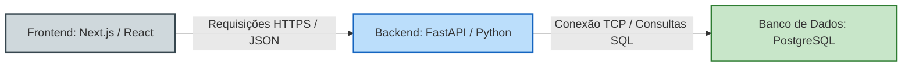
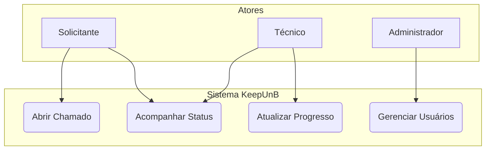
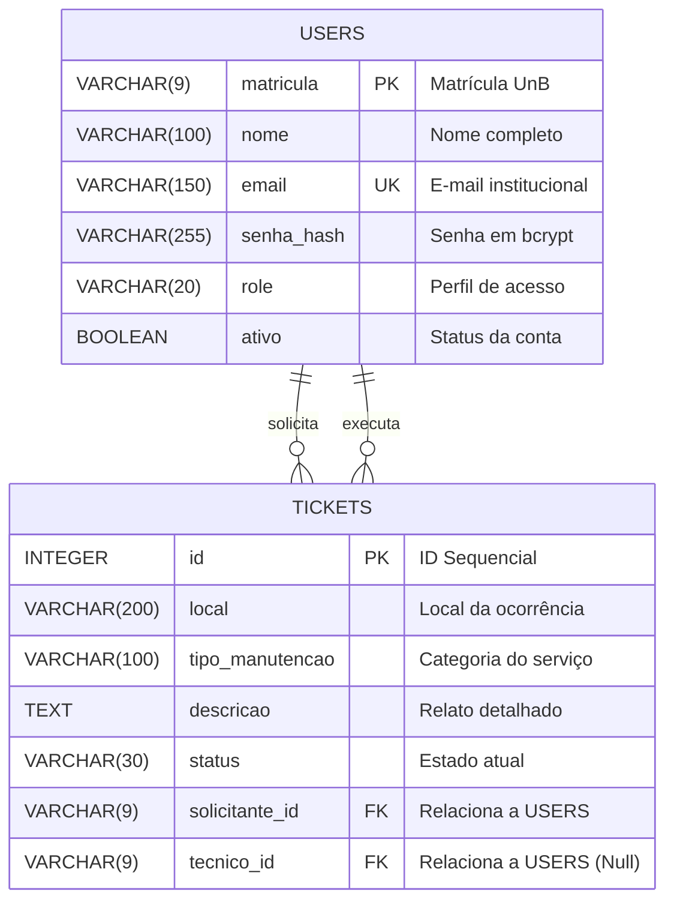

# Documento de Arquitetura de Software

**Versão:** 1.0.0  
**Data da última revisão:** 29/04/2026  
**Organização:** Parnas - KeepUnB  

---

## 1. Representação Arquitetural

A arquitetura do sistema **KeepUnB** foi desenhada com base no padrão de camadas, dividindo responsabilidades claras entre a interface do usuário, as regras de negócio e o armazenamento de dados. O ecossistema é composto por três componentes fundamentais:

* **Frontend (Apresentação):** Desenvolvido em **Next.js (React)**, responsável por renderizar a interface do usuário de forma responsiva e realizar requisições assíncronas à API.
* **Backend (Serviços e Regras de Negócio):** Desenvolvido em **FastAPI (Python)**, que provê uma API RESTful segura, gerenciando o fluxo de dados e aplicando as regras de validação.
* **Banco de Dados (Persistência):** Utiliza o **PostgreSQL** para o armazenamento de dados relacionais de forma íntegra e robusta.

### Diagrama de Relação dos Componentes

O fluxo de comunicação e dependência entre os módulos do sistema ocorre de maneira linear através de protocolos web seguros:

---

## 2. Metas e Restrições Arquiteturais

Para guiar o desenvolvimento do ecossistema KeepUnB e garantir a qualidade do produto final, foram estabelecidas diretrizes técnicas obrigatórias:

* **Tecnologias Obrigatórias:** O servidor deve ser implementado estritamente em Python (FastAPI), a interface em Next.js e o banco de dados em PostgreSQL.
* **Portabilidade:** O sistema deve ser compatível com os principais navegadores modernos (Google Chrome, Mozilla Firefox, Microsoft Edge e Safari) e possuir interface responsiva para dispositivos móveis.
* **Segurança da Informação:** O tráfego de dados sensíveis deve ocorrer sob o protocolo HTTPS. A persistência de credenciais e senhas no banco de dados deve utilizar criptografia hash com o algoritmo **bcrypt**.

---

## 3. Visão de Casos de Uso

A dinâmica de interações principais da plataforma está mapeada com base nos atores que utilizam o sistema.

### Diagrama de Casos de Uso Geral

### Descrição dos Casos de Uso Críticos

1.  **Abertura de Chamado:** Qualquer usuário autenticado da comunidade acadêmica pode registrar uma falha infraestrutural informando local, descrição e anexando evidências visuais quando aplicável.
2.  **Atualização de Status:** Técnicos designados podem modificar o estado físico do chamado (Ex: Aberto $\rightarrow$ Em Atendimento $\rightarrow$ Concluído), notificando as partes envolvidas.

---

## 4. Visão de Dados (Modelagem do Banco de Dados)

O esquema lógico do banco de dados relacional foi estruturado para suportar o rastreamento completo dos chamados e auditoria básica dos acessos.

---

## 5. Tamanho e Desempenho (Métricas Arquiteturais)

As estimativas e limites de carga volumétrica do sistema foram calculados considerando a comunidade ativa estimada para o campus da FCTE:

### Métricas de Dimensionamento de Dados

* **Volume de Usuários Estimados:** Aproximadamente 2.000 contas ativas na base.
* **Média de Chamados Diários:** Projeção de 15 a 30 novos registros de manutenção por dia.
* **Estimativa de Armazenamento de Texto:**
    * **Fórmula de Cálculo:** Tamanho médio por registro × Quantidade estimada de registros anuais
    * **Armazenamento Projetado:** Menos de 500 MB de dados puramente textuais em banco de dados após 3 anos de operação contínua.

### Métricas de Resposta do Sistema

* **Tempo de Resposta de APIs (Latência):**
    * **Operações Simples (Leitura/Escrita básica):** Tempo máximo de 200 milissegundos.
    * **Consultas Complexas (Relatórios/Filtros Avançados):** Tempo máximo de 1.000 milissegundos (1 segundo).
* **Disponibilidade Almejada:** Taxa de atividade do serviço fixada em 99,5% do tempo de operação estimado.

---

## 6. Mecanismos de Controle e Segurança

O controle de acessos e a proteção do perímetro lógico do KeepUnB operam de maneira restritiva através das seguintes políticas técnicas:

* **Autenticação Baseada em Tokens:** A validação de identidade ocorre através de **Tokens JWT (JSON Web Tokens)** transmitidos no cabeçalho das requisições HTTP (`Authorization: Bearer <token>`).
* **Visibilidade Compartilhada de Chamados:** Qualquer solicitante cadastrado pode visualizar a listagem pública dos chamados para acompanhar o progresso das manutenções do campus.
* **Anonimato do Solicitante:** Embora a listagem de chamados seja visível, a identidade (Nome e Matrícula) do solicitante original é mantida estritamente confidencial para os demais estudantes e professores, ficando visível apenas a gerentes e técnicos.
* **Isolamento de Perfis (Roles):**
    * **Técnicos e Gerentes:** Possuem controle total das ordens de serviço, porém são totalmente bloqueados de alterar permissões, níveis de acessos de contas ou configurações estruturais.
    * **Administradores:** Focam exclusivamente na gerência de usuários e segurança, sendo restritos de atuar no fluxo operacional direto de abertura ou fechamento de chamados.

---

## 7. Referências Bibliográficas

1.  BECK, Kent; ANDRES, Cynthia. **Extreme programming explained: embrace change**. 2. ed. Boston: Addison-Wesley, 2004.
2.  WASHIZAKI, Hironori (ed.). **Guide to the software engineering body of knowledge (SWEBOK Guide): version 4.0**. Los Alamitos: IEEE Computer Society, 2024. Disponível em: <https://www.swebok.org>.
3.  LANO, K. **Introduction to QVT: a mapping language for UML semantics**. 2. ed. London: Wiley-IEEE Computer Society, 2022.
