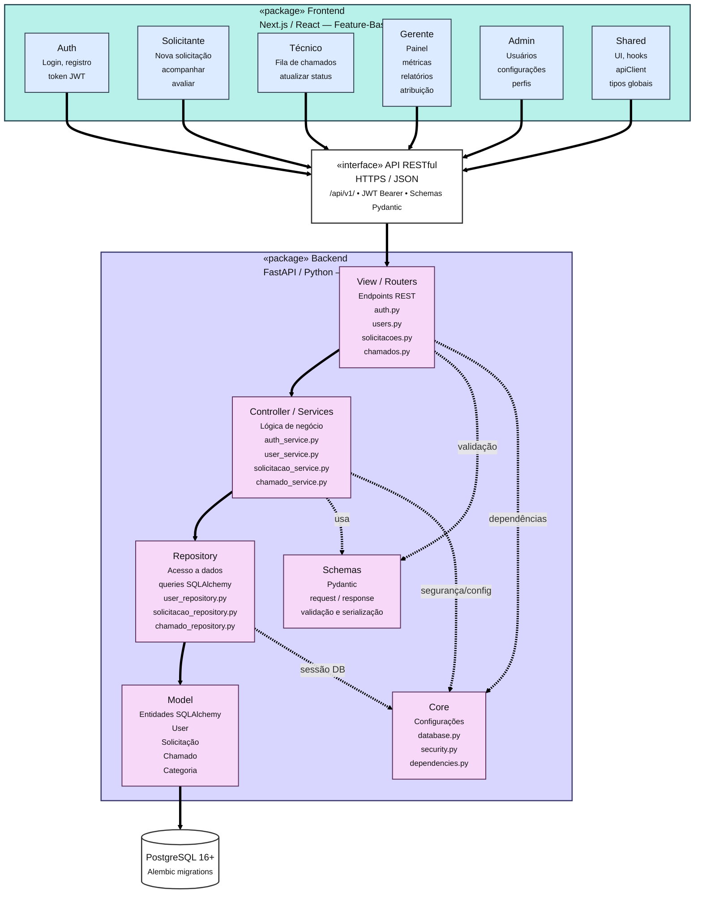
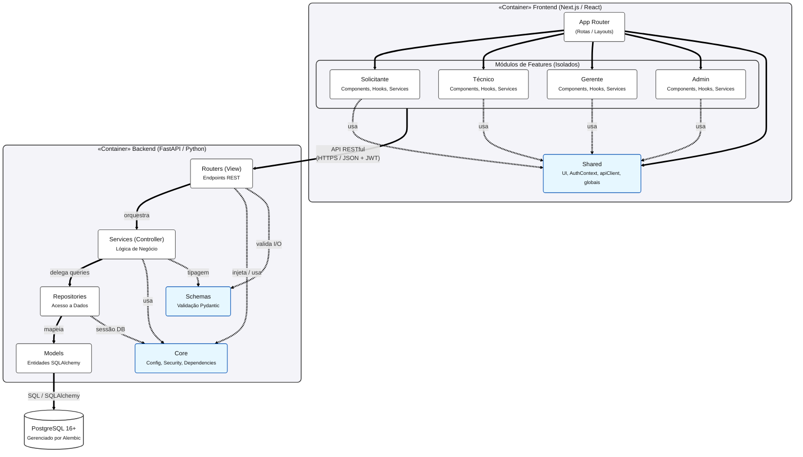

# Documento de Arquitetura de Software

**Versão:** 2.0.0  
**Data da última revisão:** 29/05/2026  
**Organização:** Parnas - KeepUnB  

---

## Histórico de Revisões
| Data | Versão | Descrição | Autor(es) |
| :--- | :--- | :--- | :--- |
| 05/05/2026 | 1.0.0 | Arquitetura inicial do produto | Grupo Parnas |
| 29/05/2026 | 2.0.0 | Alteração na estrutura do backend | Felipe Melo e Carlos Costa |

---

## 1 INTRODUÇÃO

### 1.1 Propósito
Este documento descreve a arquitetura do sistema sendo desenvolvido pelo grupo Parnas, na disciplina de Métodos de Desenvolvimento de Software, para a aplicação KeepUnB, a fim de fornecer uma visão abrangente do sistema para desenvolvedores, testadores e demais interessados em aspectos relacionados às tecnologias a serem usadas no desenvolvimento, além disso melhor o suporte para manutenção dos ambientes da UnB.

### 1.2 Escopo
O detalhamento do escopo se encontra no documento de Visão do produto e do projeto. Porém, em linhas gerais o escopo do produto compreende o desenvolvimento de uma aplicação web voltada à centralização e automatização da gestão de solicitações de manutenção da FCTE/UnB, substituindo os processos manuais e descentralizados baseados em e-mails. A plataforma atenderá quatro perfis de usuários: Solicitante, Técnico, Gerente e Administrador. O sistema viabiliza a abertura, categorização e acompanhamento em tempo real de chamados por parte dos solicitantes, engloba o controle de usuários e permissões, a estruturação de filas e atribuição de tarefas para a equipe técnica, e a disponibilização de um painel de indicadores com relatórios de desempenho para auxiliar a tomada de decisão dos gestores.

---

## 2 REPRESENTAÇÃO ARQUITETURAL

### 2.1 Definições
O sistema KeepUnB seguirá um modelo de arquitetura híbrido, combinando diferentes estilos arquiteturais para atender às necessidades específicas do backend e do frontend. No backend, será adotada a arquitetura MVC (Model-View-Controller) em conjunto com o framework FastAPI. Essa arquitetura organiza o sistema em três camadas, onde o Model representa os dados e entidades, o Controller concentra as regras de negócio e o View define os contratos de entrada e saída da API.

Dessa forma, elementos como entidades, casos de uso, adaptadores e frameworks possuem responsabilidades bem definidas. No frontend, será adotada uma arquitetura feature-based, também conhecida como organização orientada a funcionalidades. Essa abordagem estrutura o código com base nos principais módulos funcionais do sistema, como autenticação, gestão de solicitações, acompanhamento de chamados, painel de indicadores e gestão de usuários.

A comunicação entre frontend e backend ocorrerá por meio de API RESTful, utilizando HTTPS e JSON. Essa separação permite que a interface web consuma os serviços do backend de maneira padronizada, sem acesso ao banco de dados, garantindo maior controle, segurança e modularidade.

### 2.2 Motivação
A escolha de um modelo arquitetural híbrido para o KeepUnB se justifica pela necessidade de organizar o sistema de forma modular, testável e de fácil manutenção. Como o projeto será uma aplicação web composta por frontend, backend e banco de dados, a separação de responsabilidades contribui para reduzir o acoplamento entre as partes e facilitar a evolução do sistema ao longo das sprints.

No backend, a adoção do padrão MVC permite organizar o código de forma clara e familiar para a equipe, separando responsabilidades entre dados (Model), lógica de negócio (Controller) e serialização de respostas (View). Isso facilita o desenvolvimento incremental, a manutenção e a realização de testes automatizados, contribuindo para atingir a meta de qualidade definida no projeto, que prevê cobertura mínima de 80% de testes automatizados para novas funcionalidades.

Além disso, essa arquitetura favorece a manutenção do código, pois cada camada possui responsabilidade bem delimitada, reduzindo o impacto de mudanças em uma parte sobre as demais.

Portanto, a combinação entre MVC no backend e Feature-based Architecture no frontend atende às necessidades do KeepUnB, pois favorece testes, organização, manutenção, desenvolvimento incremental e separação clara de responsabilidades.

### 2.3 Detalhamento
A arquitetura do KeepUnB será organizada em dois blocos principais:
* **Frontend**, desenvolvido em Next.js/React e estruturado por funcionalidades.
* **Backend**, desenvolvido com FastAPI/Python seguindo o padrão MVC.

A comunicação entre os dois blocos ocorrerá por meio de uma API RESTful, utilizando protocolo HTTPS e dados no formato JSON. No frontend, a organização será baseada em módulos de funcionalidades. Cada módulo concentrará seus próprios componentes visuais, serviços de comunicação com a API e lógica específicas da interface.

No backend, a estrutura será dividida em três camadas. O Model representa as entidades do sistema: Usuário, Solicitação, Chamado e Técnico. Mapeadas diretamente para o banco de dados via ORM. O Controller concentra as regras de negócio, como abrir uma solicitação, atribuir um chamado, atualizar o status e gerar indicadores de desempenho. O View define os contratos de entrada e saída da API, garantindo a validação e serialização dos dados trafegados. As rotas HTTP ficam em um módulo separado de routers, responsável por direcionar cada requisição ao controller correspondente.

Por fim, a camada de frameworks e Drivers reúne os elements externos, como FastAPI, rotas HTTP, PostgreSQL e configurações de infraestrutura. O banco de dados PostgreSQL será responsável por armazenar os dados do sistema, como usuários, perfis, chamados, status, categorias e histórico de atualizações. O frontend não acessará o banco diretamente; toda comunicação será feita por meio do backend, garantindo maior controle, segurança e organização das regras de negócio.

### 2.4 Metas e Restrições Arquiteturais
O projeto deverá aderir aos padrões REST para a interface cliente-servidor, feature-based para os componentes de software e MVC para a estrutura e dependências do backend. A escolha se justifica pois o padrão RESTful é simples, escalável e rápido; o feature-based permite que múltiplas partes sejam desenvolvidas simultaneamente; e o MVC organiza o backend em camadas de responsabilidade clara e testável.

Além disso, as partes do projeto desenvolvidas em Python deverão empregar *type hinting* nas declarações de função e documentar seus comportamentos e casos de uso. Isso garante que qualquer desenvolvedor ou editor de código possa inferir o uso de qualquer função importante.

Quanto ao Git, ao desenvolver o projeto, cada funcionalidade de negócio deve ser desenvolvida em uma branch diferente, e depois unida ao tronco. A nomenclatura de cada branch deve ser do tipo `feature-[nome do componente]`. Se feito da forma correta, todos poderão desenvolver suas partes simultaneamente, e então integrar tudo com mínimos conflitos.

### 2.5 Visões
A arquitetura do KeepUnB foi definida com o objetivo de garantir organização, modularidade, facilidade de manutenção e possibilidade de expansão futura do sistema. Para representar de forma clara os diferentes aspectos estruturais e funcionais da aplicação, a arquitetura foi dividida em quatro visões complementares: visão de uso, visão organizacional lógica, visão estrutural e visão de implantação.

Cada uma dessas visões descreve o sistema sob uma perspectiva específica, permitindo compreender desde as funcionalidades disponibilizadas aos usuários até a organização interna dos componentes, suas relações e o ambiente em que a aplicação será executada. Dessa forma, as visões arquiteturais contribuem para uma melhor comunicação entre os membros da equipe e facilitam o entendimento geral da solução proposta.

#### 2.5.1 Visão de Uso
O KeepUnB é um sistema para centralizar e automatizar a gestão de manutenções na FCTE/UnB. O sistema permite que a comunidade acadêmica abra chamados e acompanhe reparos em tempo real, enquanto oferece aos gestores ferramentas para organizar tarefas, controlar permissões e gerar indicadores de decisão. O MVP focará em: Autenticação de usuários, abertura e visualização de chamados, gestão de níveis de acesso.

*(Nota: Os diagramas de Caso de Uso e de Atividades foram omitidos nesta versão de visualização de diagramas simplificada)*

#### 2.5.2 Visão de Organização Lógica
O KeepUnB é subdividido nos seguintes módulos funcionais, cada um com responsabilidade bem definida, razão lógica clara e interfaces de comunicação estabelecidas:

*   **Módulo de Autenticação:** Responsável por controlar o acesso ao sistema. Gerencia o login do usuário, a geração e validação de tokens de sessão, e a identificação do perfil de acesso. É o ponto de entrada obrigatório para qualquer outra funcionalidade, todos os demais módulos dependem de uma sessão autenticada para operar. Comunica-se com o backend via endpoint REST `/auth`, recebendo credenciais e retornando um token JWT que acompanhará as requisições subsequentes.
*   **Módulo de Gestão de Solicitações:** Permite que o Usuário Solicitante abra, edite, acompanhe e exclua suas solicitações de manutenção. Encapsula os formulários de criação, a listagem de solicitações do usuário e o acompanhamento de status. Comunica-se com a API REST via endpoints do recurso `/solicitacoes`, enviando e recebendo dados em JSON. Não possui acesso direto ao banco de dados, toda persistência é mediada pelo backend.
*   **Módulo de Acompanhamento de Chamados:** Oferece visibilidade do ciclo de vida de um chamado após sua abertura. Permite ao Solicitante acompanhar em tempo real o andamento do reparo, e avaliá-lo após a conclusão, enquanto o Técnico visualiza sua fila de trabalho, atualiza o status e registra a execução da manutenção. Consome os endpoints REST do recurso `/chamados` e reflete as atualizações de estado persistidas no PostgreSQL.
*   **Módulo de Gestão de Usuários:** Exclusivo para o perfil Administrador. Concentra as operações de criação, edição, desativação de contas e definição de permissões de acesso. Garante que os perfis do sistema estejam sempre atualizados e corretamente configurados. Comunica-se com os endpoints REST do recurso `/usuarios`.
*   **Módulo de Painel de Indicadores:** Destinado ao perfil Gerente. Exibe métricas operacionais como volume de chamados abertos, tempo médio de resolução, chamados por categoria e desempenho por técnico. Permite também a geração de relatórios. Consome endpoints analíticos da API REST, que consolidam os dados do PostgreSQL antes de enviá-los ao frontend.

##### Comunicação entre módulos e interfaces
Os módulos do frontend não se comunicam diretamente entre si nem com o banco de dados. Toda a troca de informações ocorre exclusivamente através da API RESTful do backend, utilizando HTTPS e JSON. O módulo de Autenticação é transversal a todos os demais: o token JWT gerado no login é incluído no cabeçalho de cada requisição, e o backend valida esse token antes de processar qualquer operação. A figura a seguir ilustra a organização lógica dos módulos e suas interfaces de comunicação:

###### Diagrama de Pacotes

#### 2.5.3 Visão Estrutural
A visão estrutural mapeia os blocos de construção estáticos do KeepUnB, definindo os principais elementos do sistema, suas responsabilidades individuais e a maneira como se conectam para atender aos requisitos da aplicação.

##### Elementos do Sistema e Responsabilidades
O sistema é composto por três elementos principais: o Frontend, o Backend e o Banco de Dados.

###### Frontend (Interface Web):
*   **Tecnologias:** Desenvolvido em Next.js baseado em React.
*   **Estrutura:** Organizado sob o padrão Feature-based (orientado a funcionalidades). A aplicação é dividida em módulos independentes focados nos domínios de negócio, como autenticação, gestão de solicitações, acompanhamento de chamados, gestão de usuários e painel de indicadores.
*   **Responsabilidades:** Cada módulo encapsula seus próprios componentes visuais, serviços de comunicação com a API e lógicas específicas de apresentação. O frontend é responsável por capturar as interações do usuário, renderizar interfaces responsivas e consumir os serviços do backend de forma padronizada, sem deter regras de negócio primárias ou acesso direto aos dados.

###### Backend (API e Lógica de Negócios):
*   **Tecnologias:** Desenvolvido em Python utilizando o framework FastAPI.
*   **Estrutura:** Estruturado com base no padrão MVC.
*   **Responsabilidades:** Divididas entre camadas:
    *   **Model:** Representa as entidades do domínio mapeadas via ORM, Usuário, Solicitação, Chamado e Técnico, sem lógica de negócio embutida.
    *   **Controller:** Concentra as regras de negócio, orquestrando operações como abrir solicitação, atribuir chamado, atualizar status e gerar indicadores de desempenho.
    *   **View:** Schemas Pydantic que definem o formato das requisições e respostas da API, garantindo a validação e serialização dos dados.
    *   **Routers:** Módulo que mapeia as rotas HTTP aos controllers correspondentes, sem lógica embutida.

###### Banco de Dados (Persistência):
*   **Tecnologias:** Sistema de Gerenciamento de Banco de Dados PostgreSQL.
*   **Responsabilidades:** Armazenar de forma relacional e segura todas as informações do sistema, como cadastros de usuários, perfis de acesso, chamados, status, categorias e o histórico de atualizações.

##### Conexões e Fluxo de Comunicação
Os elementos do sistema se conectam por meio de fronteiras e protocolos bem definidos para garantir a segurança e o baixo acoplamento:
*   **Frontend &rarr; Backend:** A comunicação ocorre exclusivamente através de uma API RESTful. O frontend realiza requisições seguindo o protocolo HTTPS e enviando/recebendo cargas de dados no formato JSON.
*   **Backend &rarr; Banco de Dados:** O acesso aos dados é restrito ao backend, sendo intermediado pela camada de repositórios e drivers de conexão. O frontend não possui qualquer rota de acesso direto ao PostgreSQL, garantindo que toda operação passe obrigatoriamente pela validação dos casos de uso. O fluxo estrutural de comunicação segue uma ordem estrita: o usuário interage com a interface visual no frontend; este dispara uma requisição JSON para a API RESTful; o backend recebe a requisição, processa a lógica de negócio através da Clean Architecture, consulta ou modifica o estado no PostgreSQL e, por fim, devolve uma resposta JSON para o frontend atualizar a interface.

###### Diagrama de Componentes

*(Nota: O diagrama de classes e outros diagramas estruturais adicionais foram omitidos nesta versão)*

---

## 2.6 Visão de Implantação
A estrutura do KeepUnB será sustentada por um ambiente de execução local (localhost), mantendo um modelo distribuído que isola as camadas de interface, lógica de negócio e persistência de dados.

O sistema baseia-se em tecnologias de conteinerização, logo, o ambiente operará sob hardware virtualizado nas próprias máquinas de desenvolvimento. Essa abordagem permite emular um ecossistema de produção, alocando instâncias com limites controlados de processamento e memória RAM básica. Esse dimensionamento assegura o isolamento dos processos e garante a performance adequada para as etapas de desenvolvimento, testes e validação inicial do software.

A distribuição técnica ocorrerá da seguinte forma:
*   **Ambiente de Front-end:** A interface web ocupará uma plataforma otimizada para frameworks modernos, provendo alta disponibilidade e a automação das atualizações a cada modificação no código-fonte.
*   **Ambiente de Backend:** Integrada à interface web, a API será executada em um container Docker dedicado. Essa abordagem entrega um ambiente isolado e pré-configurado para a aplicação em Python (FastAPI), assegurando agilidade na execução e consistência entre as máquinas dos desenvolvedores, sem a complexidade de gerenciar instalações e dependências diretamente no sistema operacional.
*   **Banco de Dados (Persistência):** O banco relacional operará no mesmo ecossistema de containers, porém de maneira isolada em uma rede virtual interna (Docker network). Para preservar a arquitetura de segurança e emular restrições de produção, a base de dados não possuirá portas expostas externamente, sendo acessível exclusivamente pelo container do backend. Dessa forma, qualquer operação de leitura ou escrita passa obrigatoriamente pelas validações do sistema antes de ser efetivada.

---

## 2.7 Restrições adicionais

### Restrições Operacionais
O sistema opera em ambiente de execução local (localhost), não possuindo áreas de navegação aberta. O uso é estritamente condicionado à simulação de autenticação prévia de usuários vinculados à comunidade da FCTE/UnB.

### Características de Qualidade
*   **Usabilidade:** O fluxo de abertura de chamados impõe uma restrição de design, pois deve possuir baixa curva de aprendizado para dispensar qualquer treinamento prévio aos solicitantes.
*   **Confiabilidade:** Como restrição de entrega técnica, qualquer nova funcionalidade só será incorporada se passar na validação de testes automatizados com cobertura mínima de 80%.

### Segurança e Limites de Acesso
Para garantir o isolamento entre os quatro perfis de usuário, o sistema adota o princípio do menor privilégio, apoiado pela restrição de rede interna dos containers, em que o banco de dados não expõe portas de acesso externo. As permissões impõem os seguintes bloqueios sistêmicos:
*   **Visibilidade de Chamados:** Solicitantes podem visualizar todos os chamados do sistema para acompanhar o status, progresso e local das manutenções.
*   **Anonimato do Solicitante:** A identidade de quem abriu o chamado é confidencial e fica sempre oculta para os demais solicitantes.
*   **Técnicos e Gerentes:** Não possuem autorização para alterar perfis de usuários ou configurações de sistema.
*   **Administradores:** Focam na gestão de acesso, sendo bloqueados de atuar no fluxo operacional de abertura ou resolução de manutenções.
*   **Validação de Segurança:** Toda requisição exige validação de token JWT no backend para ser processada.

---

## 3 BIBLIOGRAFIA

1.  **Extreme Programming:**  
    BECK, Kent; ANDRES, Cynthia. **Extreme programming explained: embrace change**. 2. ed. Boston: Addison-Wesley, 2004.
2.  **SWEBOK v4:**  
    WASHIZAKI, Hironori (ed.). **Guide to the software engineering body of knowledge (SWEBOK Guide): version 4.0**. Los Alamitos: IEEE Computer Society, 2024. Disponível em: <https://www.swebok.org>. Acesso em: 29 abr. 2026.
3.  **UML Semantics 2:**  
    Lano, K.: **Introduction to the unified modeling language**. In: Lano, K. (ed.) UML 2 Semantics and Applications. Wiley, Hoboken (2009)
4.  **Secure by design:**  
    JOHNSSON, Dan Bergh; DEOGUN, Daniel; SAWANO, Daniel. **Secure by design**. Shelter Island: Manning Publications, 2019.

---

> [!TIP]
> Caso prefira, você pode [abrir o Documento de Arquitetura em formato PDF diretamente](./Doc_arquitetura_parnas.pdf).
