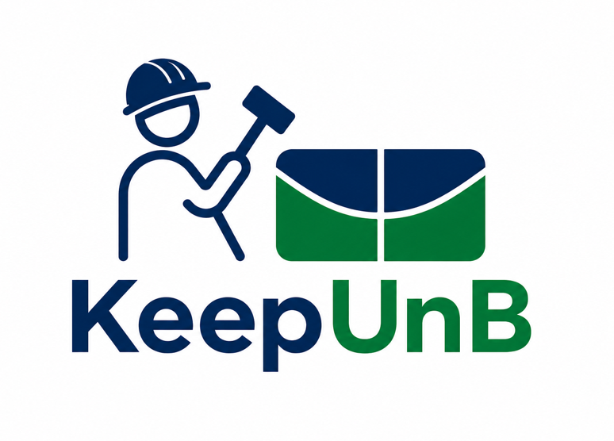

<section class="keepunb-hero" markdown>
  

    Guia oficial
    <h1>KeepUnB</h1>
    

      Sistema de manutenção da UnB reunindo guias de execução, arquitetura,
      banco de dados, sprints e equipe.
    

  

  

    
    

      <strong>Base do projeto</strong>
      Execução local, arquitetura, banco de dados, sprints e equipe.
    

  

  

    <a class="keepunb-button keepunb-button--primary" href="como-executar/tutorial/">
      +
      Começar agora
    </a>
    <a class="keepunb-button keepunb-button--secondary" href="visao/visao-pdf/">
      i
      Ver visão do projeto
    </a>
  

</section>

<section class="keepunb-overview" markdown>

## O que é o KeepUnB

O **KeepUnB** é uma aplicação web para centralizar solicitações de manutenção
da UnB-FCTE. O sistema substitui fluxos manuais e comunicações dispersas por
um canal único para abrir chamados, acompanhar status, atribuir técnicos e
monitorar indicadores operacionais.

  <strong>Problema</strong>
  Pedidos dispersos, pouca rastreabilidade e demora no atendimento

  <strong>Solução</strong>
  Canal único para registrar, priorizar e acompanhar manutenções

  <strong>Impacto</strong>
  Mais transparência para solicitantes, técnicos e gestores

</section>

<section class="keepunb-section" markdown>

## Escopo principal

-   :material-clipboard-plus-outline: **Registro de chamados**

    O solicitante informa local, categoria e descrição do problema de
    manutenção.

-   :material-progress-clock: **Acompanhamento**

    O pedido mantém histórico e status para reduzir perda de informações e
    retrabalho.

-   :material-account-hard-hat-outline: **Fila técnica**

    Técnicos visualizam chamados atribuídos, iniciam atendimento e atualizam a
    execução.

-   :material-chart-box-outline: **Gestão operacional**

    Gerentes acompanham volume, prioridades, tempo médio e relatórios de
    atendimento.

</section>

<section class="keepunb-section" markdown>

## Perfis de uso

-   :material-account-outline: **Solicitante**

    Comunidade acadêmica que abre chamados, acompanha o andamento e avalia o
    atendimento ao final do fluxo.

-   :material-account-hard-hat-outline: **Técnico**

    Equipe responsável por consultar chamados atribuídos, executar manutenções
    e atualizar status.

-   :material-account-tie-outline: **Gerente**

    Supervisão operacional com visão global da fila, delegação de chamados e
    análise de indicadores.

-   :material-shield-account-outline: **Administrador**

    Gestão técnica de usuários, perfis de acesso e configurações transversais
    da plataforma.

</section>

<section class="keepunb-section" markdown>

## Acesse rapidamente

-   :material-play-circle-outline: **Como executar**

    Configure o ambiente local e suba o projeto com Docker Compose.

    [Abrir guia](como-executar/tutorial.md)

-   :material-eye-outline: **Visão do Projeto**

    Entenda objetivos, público, escopo, riscos e indicadores do projeto.

    [Abrir visão](visao/visao-pdf.md)

-   :material-sitemap-outline: **Arquitetura**

    Consulte a organização técnica, componentes e decisões estruturais.

    [Ver arquitetura](arq/arq-pdf.md)

-   :material-database-outline: **Banco de Dados**

    Confira a modelagem inicial e os relacionamentos entre entidades.

    [Ver modelagem](banco-de-dados/diagrama-relacionamento-inicial.md)

</section>
