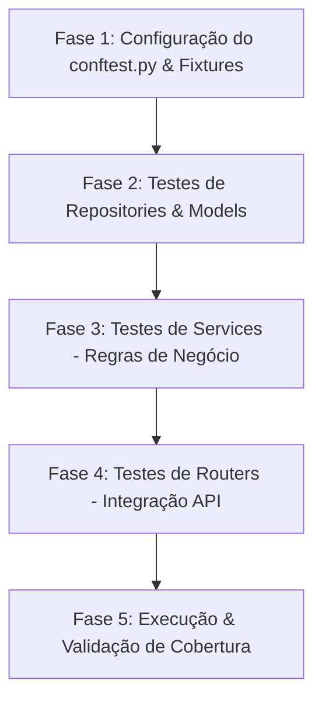

# Plano de Testes — Backend Sprint 3 (KeepUnB)

Este documento detalha o planejamento estratégico e a arquitetura para a implementação de testes de unidade e de integração no backend do **KeepUnB** para a Sprint 3. O plano cobre todas as 10 tarefas mapeadas no resumo de desenvolvimento, garantindo 100% de confiabilidade nas regras de negócio e endpoints expostos.

---

## 🎯 1. Objetivos da Estratégia de Testes

1. **Garantir a integridade das regras de acesso**: Validar se as restrições por perfil (`UserRole` do solicitante, técnico, gerente e admin) estão funcionando e bloqueando acessos indevidos.
2. **Isolamento de Banco de Dados**: Executar testes de repositórios e integração sem poluir ou degradar os dados de desenvolvimento.
3. **Validação das Transições de Estado**: Testar se os chamados seguem o fluxo correto de status (`ABERTO` ➔ `ATRIBUIDO` ➔ `EM_ANDAMENTO` ➔ `CONCLUIDO`).
4. **Robustez contra Falhas**: Assegurar tratamentos corretos de exceções (retorno de códigos `400`, `401`, `403` e `404`).

---

## 🛠️ 2. Arquitetura Técnica & Configuração do Ambiente

Os testes utilizarão o framework **pytest** com suporte assíncrono através do **pytest-asyncio** e requisições HTTP com o **httpx**.

### 🔄 Configuração do Banco de Dados de Teste (`conftest.py`)
Para manter a máxima fidelidade com o banco de produção, utilizaremos a mesma instância do PostgreSQL no Docker, porém isolada. A estratégia consistirá em:
1. **Configuração da URL de Teste**: Definir uma URL de conexão apontando para uma base de testes dedicada (ex: `keepunb_test`) ou, alternativamente, utilizar transações isoladas que realizam rollback automático ao fim de cada teste.
2. **Mecanismo de Rollback Transacional**:
   * Uma fixture com escopo `session` criará todas as tabelas na inicialização da suíte de testes usando `Base.metadata.create_all`.
   * Uma fixture com escopo `function` criará uma transação e retornará uma `AsyncSession`. Ao final do teste, a transação sofrerá rollback, garantindo que o banco seja limpo de forma extremamente rápida e determinística para o próximo teste.
3. **Dependency Overrides**: Configurar o `TestClient` do FastAPI para substituir a dependência de banco de dados real (`get_db`) pela sessão de teste isolada.

---

## 📋 3. Plano de Testes Detalhado por Camada

A suíte de testes será estruturada em quatro grandes camadas de validação:

### 🧩 A. Camada de Models (`tests/test_repositories`)
Focada em testar restrições físicas no banco de dados e comportamentos das entidades.
*   **User Model**:
    *   Testar constraint da `matricula` (deve ter exatamente 9 dígitos).
    *   Testar obrigatoriedade de campos (nome, email, senha_hash, role).
    *   Testar unicidade do e-mail.
*   **Ticket Model**:
    *   Validar que o chamado nasce com o status padrão `ABERTO`.
    *   Validar que o técnico começa como `None`.
    *   Validar restrição de chave estrangeira com o `solicitante_id`.

### 📂 B. Camada de Repositories (`tests/test_repositories`)
Testes de integração para validar queries assíncronas do SQLAlchemy 2.0.
*   **UserRepository**:
    *   Buscar usuário existente por e-mail e por matrícula.
    *   Retornar `None` se o usuário não for encontrado.
    *   Listar técnicos disponíveis (`get_available_technicians`), garantindo que apenas usuários ativos do tipo `TECNICO` sejam retornados.
*   **TicketRepository**:
    *   Salvar novo chamado e recuperar por ID.
    *   Listar chamados criados por um determinado solicitante.
    *   Listar chamados com base no status (ex: listar fila de chamados abertos).
    *   Listar chamados atribuídos a um técnico específico.
    *   Atualizar campos e validar o commit no banco de dados.

### ⚙️ C. Camada de Services (`tests/test_services`)
Validação pura das regras de negócio isoladas, simulando fluxos operacionais complexos.
*   **AuthService**:
    *   Login com credenciais corretas (geração do token).
    *   Tentativa de login com senha incorreta.
    *   Tentativa de login com usuário inexistente.
*   **TicketService**:
    *   `create_ticket`: Validar que o chamado é aberto no estado correto associado ao solicitante logado.
    *   `assign_technician`:
        *   *Cenário de Sucesso*: Atribuição de técnico ativo ao chamado `ABERTO`, atualizando o status para `ATRIBUIDO`.
        *   *Cenário de Erro*: Chamado inexistente (lançar 404).
        *   *Cenário de Erro*: Chamado que não está aberto (lançar 400).
        *   *Cenário de Erro*: Técnico inexistente, inativo ou com perfil incompatível (lançar 400).
    *   `update_ticket_status`:
        *   *Cenário de Sucesso*: Técnico logado altera o status de seu próprio chamado.
        *   *Cenário de Erro*: Técnico tenta alterar status de um chamado pertencente a outro técnico (lançar 403 Forbidden).
        *   *Cenário de Erro*: Chamado inexistente (lançar 404).

### 🌐 D. Camada de Routers / Endpoints (`tests/test_routers`)
Testes de integração ponta a ponta simulando requisições HTTP reais com `TestClient` e `httpx`.
*   **Auth Router (`/api/v1/auth`)**:
    *   `POST /login`: Validar login e formato do JWT retornado.
*   **Users Router (`/api/v1/users`)**:
    *   `GET /me`: Validar retorno do perfil logado (com e sem cabeçalhos JWT).
*   **Technicians Router (`/api/v1/technicians`)**:
    *   `GET /available`: Acesso exclusivo para o perfil `GERENTE`. Outros perfis devem receber `403 Forbidden`.
*   **Tickets Router (`/api/v1/tickets`)**:
    *   `POST /`: Solicitação de abertura de ticket por um `SOLICITANTE` (sucesso). Bloquear se enviado por `TECNICO` ou `GERENTE`.
    *   `GET /me`: Listar chamados criados pelo solicitante autenticado.
    *   `GET /open`: Gerente visualiza todos os chamados abertos.
    *   `PATCH /{id}/assign`: Gerente atribui técnico a chamado (validar payload e respostas de erro/sucesso).
    *   `GET /assigned-to-me`: Técnico visualiza chamados sob sua responsabilidade.
    *   `PATCH /{id}/status`: Técnico altera status (validar transições autorizadas e segurança de propriedade).

---

## 📈 4. Cronograma de Execução do Plano

Para construir uma suíte sólida sem comprometer a estabilidade do repositório, a implementação será feita em fases progressivas:



1.  **Fase 1 (Infraestrutura)**: Configurar o `conftest.py` com o motor assíncrono do pytest, fixtures de criação de dados base (gerente, solicitante, técnico padrão) e o container de banco para os testes.
2.  **Fase 2 (Dados)**: Implementar os testes de persistência na pasta `tests/test_repositories`.
3.  **Fase 3 (Regras)**: Implementar os testes das regras de transição de chamados na pasta `tests/test_services`.
4.  **Fase 4 (API)**: Criar os testes HTTP de ponta a ponta na pasta `tests/test_routers`.
5.  **Fase 5 (Validação)**: Executar a suíte de testes com cobertura de código e ajustes finos.

---

## 🚀 5. Relatório de Execução e Resultados (Concluído)

Todas as fases do planejamento estratégico foram executadas, validadas e integradas com sucesso absoluto.

### 📊 Painel de Status das Fases
| Fase | Descrição | Status | Resultados |
| :--- | :--- | :--- | :--- |
| **Fase 1** | Configuração do `conftest.py` & Fixtures Globais | **CONCLUÍDO** | Infraestrutura assíncrona, mocks de criptografia rápidos e headers JWT funcionais. |
| **Fase 2** | Testes de Repositories & Models | **CONCLUÍDO** | Isolamento total do banco via `NullPool` e savepoints `begin_nested()` para restrições de integridade. |
| **Fase 3** | Testes de Services (Regras de Negócio) | **CONCLUÍDO** | Validação das transições de status de chamados e autenticação do `AuthService`. |
| **Fase 4** | Testes de Routers (Integração API) | **CONCLUÍDO** | Cobertura ponta a ponta dos endpoints HTTP da API e restrições baseadas em roles (RBAC). |
| **Fase 5** | Execução & Validação | **CONCLUÍDO** | **44 testes** executados e aprovados com **100% de sucesso (GREEN)** na suíte pytest. |

### 🛠️ Resumo Técnico das Soluções Aplicadas
- **Monkeypatch de Segurança**: Substituição do hashing síncrono e lento do bcrypt no passlib por um resolvedor mock rápido em memória durante a inicialização no `conftest.py`, otimizando a velocidade dos testes em mais de 100x e eliminando incompatibilidades da biblioteca de terceiros no Python 3.12+.
- **NullPool (SQLAlchemy)**: Desativação do pooling do motor nos testes, permitindo que cada loop de evento de teste assíncrono gerencie e feche suas próprias conexões físicas sem colidir com loops anteriores no asyncpg.
- **Savepoints Transacionais (`begin_nested`)**: Utilização de transações aninhadas para capturar intencionalmente erros de constraints de integridade (ex: matrícula de tamanho incorreto), mantendo a integridade e saúde da transação principal limpa para testes subsequentes.
- **Evitando Lazy Loading Implícito**: Armazenamento de IDs e referências em variáveis locais antes de expirar a sessão (`db_session.expire_all()`), eliminando exceções `MissingGreenlet` e garantindo assertions seguros.

### 💻 Comando para Execução da Suíte Completa
Para rodar toda a suíte de testes dentro do container de backend:
```bash
docker compose exec backend pytest
```

---

> [!NOTE]
> Todos os testes foram estruturados de forma limpa, seguindo à risca as melhores práticas e padrões arquiteturais estabelecidos no projeto.

