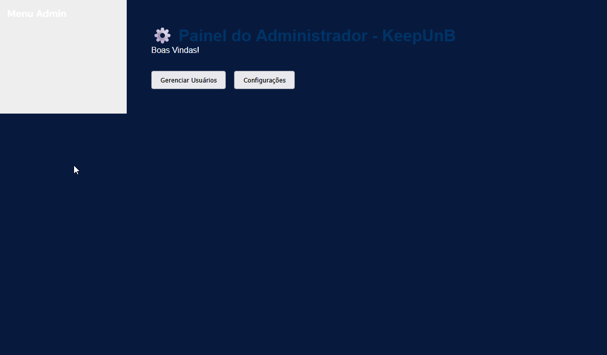

# Relatório de Qualidade (QA) - Sprint 4

> 📌 **Baseado no commit:** [`3160cb1`](https://github.com/FGA0138-MDS-Ajax/2026.1-T03-Parnas/commit/3160cb1b9ab4e81aa8a15867953dd9ed3ab943d1) · **branch:** `developer`

Este documento detalha os testes de sistema, verificações de interface e funcionalidades pendentes identificadas durante a **Sprint 4**.

---

## 1. Páginas e Funcionalidades Incompletas

- **Esqueci minha senha**: Página e funcionalidade de recuperação de senha ainda não foram implementadas.
- **Registro de usuário ✅**: Página e funcionalidade de criação de conta ainda não foram implementadas (Resolvido).
- **Exportar relatório em PDF**: Funcionalidade de exportação na aba de relatórios do perfil de gerente ainda não foi implementada.
- **Painel do administrador ✅**: Página e funcionalidades de gerenciamento de usuários e configurações ainda não foram implementadas (Resolvido).

---

## 2. Problemas de Interface

### Frontpage (Layout Mobile) ✅
A interface da *frontpage* precisava de ajustes para exibição correta em dispositivos móveis. (Resolvido)

### Overflow de texto
Locais com muitos caracteres transbordam a interface do Desktop e do Mobile nas seguintes páginas:

- **Dashboard do Solicitante** (`/solicitante/dashboard`)
  

- **Atribuição do Gerente** (`/gerente/atribuicao`)
  

- **Painel do Gerente** (`/gerente/painel` - especificamente no painel de delegação de chamado)
  

- **Fila do Técnico** (`/tecnico/fila`)
  

- **Detalhe do Chamado** (`/tecnico/chamado`)
  

### Adequar página do Técnico para o mobile ✅

---

## 3. Sugestões de Melhoria

- **Prioridade Baixa 🟢**: Separar chamados baseado no status atual para todos os perfis (pode ser implementado por “ordenar por status” ou organizando em seções). ✅ *(Resolvido)*
