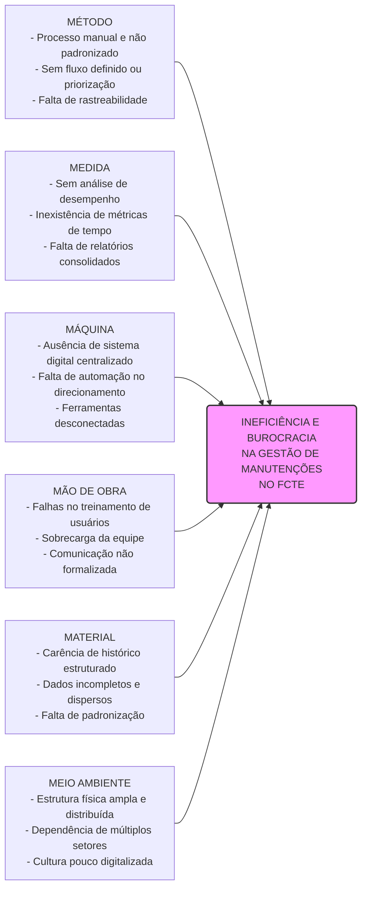
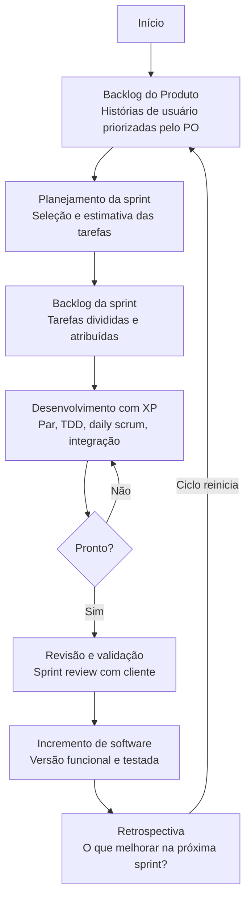

# Visão do Produto e do Projeto

!!! success "Observação"
    Caso prefira, você pode [abrir o Documento de Visão em formato PDF diretamente](./visao_parnas.pdf), ou [baixar versão no formato _.docx_](./visao_parnas.docx).

## 1 VISÃO GERAL DO PRODUTO

### 1.1 Problema
A Faculdade de Ciências e Tecnologias em Engenharia da Universidade de Brasília (UnB-FCTE) conta com uma ampla infraestrutura de laboratórios, salas de aula, equipamentos de uso intensivo e demais instalações. Para garantir o pleno funcionamento do campus, manutenções preventivas e corretivas são exigidas constantemente. Atualmente, o fluxo para reportar defeitos, requisitar manutenções, alocar técnicos e monitorar o status dos consertos baseia-se em processos manuais, registros físicos e comunicações fragmentadas.

Nesse contexto, percebe-se a ineficiência e a descentralização na gestão dos processos de manutenção. A ausência de um canal padronizado ocasiona desorganização, resultando em chamados duplicados, perda de dados e lentidão na resposta e na execução. Com isso, o solicitante não consegue acompanhar o andamento do seu pedido, ao mesmo tempo em que os gestores e responsáveis não têm informações sistematizadas sobre o progresso e a dinâmica das operações, o que gera ineficácia nas resoluções dos problemas do campus.

#### Diagrama de Ishikawa

O Diagrama de Ishikawa elaborado evidencia que os principais problemas no processo de atendimento estão distribuídos em seis categorias:
*   **Método:** observa-se um processo manual e não padronizado de abertura de chamados, sem fluxo definido, ausência de priorização, inexistência de tempos de resposta estabelecidos e falta de rastreabilidade.
*   **Medida:** destacam-se a ausência de análise de desempenho da equipe, inexistência de métricas de tempo de atendimento, falta de relatórios consolidados e de monitoramento de gargalos.
*   **Máquina:** identifica-se a ausência de um sistema digital centralizado, falta de automação no direcionamento de chamados e o uso de ferramentas de comunicação desconectadas.
*   **Meio Ambiente:** o cenário é impactado por uma estrutura física ampla e distribuída, dependência de múltiplos setores, alto volume de demandas simultâneas e uma cultura organizacional pouco digitalizada.
*   **Material:** há carência de histórico estruturado de manutenções, presença de dados incompletos e descentralizados, além da falta de padronização das informações.
*   **Mão de Obra:** verificam-se falhas no treinamento dos usuários, ausência de padronização na atuação dos técnicos, sobrecarga da equipe de manutenção, indefinição de responsabilidades e comunicação não formalizada entre os envolvidos.

### 1.2 Declaração de Posição do Produto
O Keep UnB visa preencher a lacuna tecnológica na gestão de infraestrutura acadêmica, oferecendo uma plataforma ágil e focada na transparência entre a comunidade acadêmica e a equipe de manutenção. O quadro a seguir resume a posição do produto no mercado:

| Campo | Descrição |
| :--- | :--- |
| **Para:** | Frequentadores da UnB - FCTE |
| **Necessidade:** | Os equipamentos e espaços da FCTE sofrem uso constante e precisam ser reparados com frequência. Entretanto, percebe-se uma dificuldade de acesso aos canais de solicitação de manutenção e de acompanhamento do andamento dos serviços. |
| **O (nome do produto):** | É uma aplicação Web, nomeada Keep UnB. |
| **Que:** | O principal benefício trazido pela aplicação é a centralização e a automatização de solicitações, em conjunto com o gerenciamento e o acompanhamento dos processos em tempo real, condensando todas as etapas em uma única aplicação. |
| **Ao contrário:** | A alternativa primária é o modelo vigente, em que as solicitações de manutenção são direcionadas diretamente ao e-mail da Coordenadoria de Manutenção de Equipamentos (Cmeq). Sem o Keep UnB, a consequência é um processo descentralizado, no qual os pedidos podem passar despercebidos ou ser perdidos, dificultando a realização do serviço por parte da equipe. Em oposição a isso, o software desenvolvido pretende tornar essa interação mais acessível, centralizada e gerenciável. |
| **Nosso produto:** | O Keep UnB permitirá a criação de solicitações a partir de um sistema de especificação automatizado e a visualização dos processos, tudo isso reunido em uma interface visual agradável, acessível e concisa. |

### 1.3 Objetivos do Produto
**Objetivo Principal:**
Entregar uma plataforma web funcional que centralize e automatize a gestão de solicitações de manutenção da FCTE, substituindo o modelo atual descentralizado baseado em e-mails e processos manuais.

**Objetivos Secundários:**
*   **Proporcionar acompanhamento dos chamados**, permitindo que o solicitante visualize o andamento do seu pedido em tempo real, eliminando a falta de retorno característica do processo atual.
*   **Aumentar a clareza das atribuições** para a equipe técnica, organizando e priorizando a fila de manutenções de forma estruturada.
*   **Gerar dados concretos de desempenho** por meio de um painel de indicadores, fornecendo à gestão embasamento para decisões como investimentos em infraestrutura ou substituição de equipamentos com falhas recorrentes.
*   **Transformar o processo de solicitação de manutenção da FCTE**, reduzindo a dependência de comunicações informais e promovendo um fluxo padronizado e auditável.

### 1.4 Tecnologias a Serem Utilizadas
*   **Backend:** Python + FastAPI (Frameworks)
*   **Banco de Dados:** PostgreSQL
*   **Frontend:** Next.js baseado em React
*   **Controle de versão e CI/CD:** GitHub e GitHub Actions
*   **Integração Front e Back:** HTTPS/REST com JSON
*   **Métodos:** ScrumXP, abordagem interativa/incremental

---

## 2 VISÃO GERAL DO PROJETO

### 2.1 Ciclo de vida do projeto de desenvolvimento de software
O projeto Keep UnB adotará um ciclo de vida iterativo e incremental, fundamentado em métodos ágeis. Esta escolha permite que o software seja desenvolvido em pequenas funcionalidades, possibilitando entregas frequentes, adaptação rápida e divisão de tarefas eficientemente.

*   **Metodologia:** Desenvolvimento Ágil, prioridade na colaboração, software em funcionamento e a capacidade de responder a mudanças em vez de um plano rígido e extenso em documentação (WASHIZAKI, 2024).
*   **Processo:** O Processo é estruturado através do Scrum, trabalho dividido em Sprints, onde cada sprint contempla atividades de planejamento, acompanhamento semanal, revisão e retrospectiva.
*   **Procedimentos:** As solicitações de manutenção e funcionalidades são organizadas no Backlog do Produto, priorizadas conforme o valor para o usuário da FCTE (solicitantes, técnicos e gestores), o backlog será validado pelo Product Owner para garantir que atendam as necessidades reais do produto.
*   **Métodos:** Para complementar o Scrum, práticas de Extreme Programming (XP) são aplicadas para garantir a qualidade do código. Refatoração, melhoria contínua do código, visando manter a manutenibilidade do sistema (BECK; ANDRES, 2004).
*   **Ferramentas:** GitHub, controle de versão, gerenciamento do código fonte e organização. Notion, divisão de tarefas e facilidade de comunicação.

### 2.2 Organização do Projeto

| Papel | Atribuições | Responsável | Participantes |
| :--- | :--- | :--- | :--- |
| **Dono do produto** | Definir o escopo do produto, gestão do backlog, tomada de decisões, validação de entregas. | Felipe Melo | Felipe Melo |
| **Scrum Master** | Garantir a aplicação do framework ágil, remoção de impedimentos, facilitação de cerimônias, mentoria da equipe. | Arthur Mariani | Arthur Mariani |
| **Arquiteto de Software** | Definir a estrutura do sistema, escolha de tecnologias, garantia de escalabilidade, padronização técnica. | Carlos Costa | Carlos Costa |
| **Desenvolvedores back-end** | Construção da lógica de negócios, gestão de banco de dados, criação de APIs, garantia de segurança da aplicação. | Felipe Melo | Carlos Costa, Felipe Melo, Arthur Mariani, Charles Ruan, Daniel Carneiro |
| **Desenvolvedores front-end (UX/UI)** | Criação de protótipos, design de interfaces, pesquisa com usuários, garantia de usabilidade e acessibilidade. | Caio Nápoles | Daniel Velloso, Caio Nápoles, Arthur Coelho |
| **Analistas de qualidade** | Execução de testes manuais e automatizados, identificação de bugs, validação de requisitos, garantia da estabilidade. | Rodrigo Barbosa | Daniel Ribeiro, Rodrigo Barbosa |
| **Analistas de requisitos e documentação** | Levantamento de necessidades, escrita de especificações técnicas, criação de manuais, mapeamento de processos. | Guilherme Souza | Guilherme Souza, Rodrigo Barbosa, Arthur Mariani |
| **Engenheiro de Dados** | Modelagem de dados, criação de pipelines (ETL), integração de fontes de dados, otimização de consultas. | Pietro Ritchele | Carlos, Daniel Ribeiro, Pietro |
| **Cliente** | Validar requisitos e entregas, fornecer feedback sobre o sistema, representar as necessidades. | Daniel Ribeiro | Daniel Ribeiro |

### 2.3 Planejamento das Fases e/ou Iterações do Projeto

| Sprint | Produto (Entrega) | Data Início | Data Fim | Entregável | Responsáveis | Conclusão |
| :---: | :--- | :---: | :---: | :--- | :--- | :---: |
| **Sprint 0** | Estudo do produto | 04/05/2026 | 11/05/2026 | Base de conhecimento | Dono do produto, Analista de requisitos e documentação, Arquiteto de Software e Engenheiro de Dados | 100% |
| **Sprint 1** | Definição do Produto | 11/05/2026 | 18/05/2026 | Documento de Visão | Dono do produto, Analista de requisitos e documentação | 100% |
| **Sprint 2** | Planejamento da Arquitetura | 18/05/2026 | 25/05/2026 | Documento de Arquitetura | Arquiteto de Software, Engenheiro de Dados, Analista de Requisitos e Documentação | 100% |
| **Sprint 3** | Elaboração de base para o projeto | 25/05/2026 | 31/05/2026 | Base sólida para o desenvolvimento | Desenvolvedores Backend, Desenvolvedores Frontend, Analista de Qualidade | 100% |
| **Sprint 4** | Consolidar o fluxo principal do KeepUnB, integrando frontend, backend e banco de dados. | 01/06/2026 | 08/06/2026 | MVP | Desenvolvedores Backend, Desenvolvedores Frontend, Analista de Qualidade | 100% |
| **Sprint 5** | Refinamento do MVP, segurança e padronização. | 08/06/2026 | 15/06/2026 | Versão beta (v1.0.0) | Desenvolvedores Backend, Desenvolvedores Frontend, Engenheiro de dados, Analista de Qualidade | 0% |

### 2.4 Matriz de Comunicação

| Descrição | Área / Envolvidos | Periodicidade | Produtos Gerados |
| :--- | :--- | :--- | :--- |
| **Gestão Operacional e Acompanhamento de Tarefas** | Equipe do Projeto | Contínua (Diária) | Quadro Kanban e Dashboard de Tasks atualizados no Notion. |
| **Alinhamento Técnico e Repasse de Atividades (Daily/Weekly)** | Equipe do Projeto | Semanal | Atas de Reunião e Cronograma atualizado. |
| **Acompanhamento dos Riscos, Compromissos, Ações Pendentes, Indicadores** | Equipe do Projeto | Quinzenal | Relatório de situação do projeto |
| **Comunicar situação do projeto** | Equipe do Projeto, Professor e Monitor | Semanal | Relatório de Situação do Projeto e artefatos de software. |

### 2.5 Gerenciamento de Riscos

| Risco | Grau de exposição | Plano de mitigação | Plano de contingência |
| :--- | :--- | :--- | :--- |
| **Saída de membro-chave da equipe durante o projeto** | Alto | Documentar conhecimento, fazer pair programming e manter mais de um responsável por cada módulo | Redistribuir tarefas entre a equipe e acionar o professor/monitor para revisar o escopo |
| **Atraso na entrega de uma funcionalidade crítica** | Alto | Manter backlog priorizado e fazer sprints curtas com revisões semanais | Entregar MVP da funcionalidade e registrar o débito técnico para iteração futura |
| **Falha de comunicação entre membros da equipe** | Médio | Definir canais oficiais (Notion, Teams) e rituais de reunião fixos | Realizar reunião de alinhamento emergencial e redistribuir responsabilidades |
| **Mudança de requisitos pelo cliente/orientador** | Médio | Validar requisitos formalmente em cada fase e manter ata de reunião assinada | Negociar prazo e/ou escopo com o orientador, priorizando o que já foi entregue |
| **Indisponibilidade de ferramenta ou serviço externo** | Baixo | Usar ferramentas com boa reputação de uptime e manter alternativas mapeadas | Migrar para a ferramenta alternativa já identificada |
| **Dificuldade técnica com a stack tecnológica (Curva de aprendizado)** | Alto | Realizar estudos dirigidos, promover pair programming entre membros com diferentes níveis de conhecimento. | Simplificar a arquitetura planejada, reduzindo a complexidade técnica, ou a alternativa já dominada pela equipe para garantir o MVP. |

### 2.6 Critérios de Replanejamento
O processo de replanejamento é essencial para a adaptação do projeto caso ocorram desvios ou imprevistos no plano original. Para reagir a esses eventos, a principal abordagem adotada será o acompanhamento contínuo, seguido de revisões e atualizações sempre que se mostrarem necessárias.

O projeto entrará em fase de replanejamento quando os seguintes gatilhos forem acionados:
*   **Concretização de riscos com alto grau de exposição:** Especialmente quando acompanhada da obsolescência ou ineficácia do plano de contingência previsto para o caso.
*   **Identificação de novos riscos:** Ameaças não mapeadas anteriormente que possuam caráter limitante para o projeto.
*   **Insuficiência dos planos de mitigação:** Quando as ações preventivas não surtem o efeito desejado para conter as ameaças.
*   **Desvios de cronograma:** Atrasos cumulativos que ultrapassem a margem de segurança estabelecida para o desenvolvimento do projeto.
*   **Novos requisitos:** Solicitações que exijam mudanças técnicas profundas na estrutura, arquitetura ou tecnologias utilizadas.

Como forma de controle e documentação, esse processo ocorrerá de maneira cíclica, englobando desde a análise da necessidade de replanejamento até a revisão dos próprios critérios e matriz de riscos. A cada nova revisão ou alteração, haverá o versionamento adequado do documento, baseado no grau de interferência das mudanças realizadas.

---

## 3 PROCESSO DE DESENVOLVIMENTO DE SOFTWARE

O processo do Keep UnB adota um ciclo iterativo e incremental, combinando o Scrum com práticas de XP (BECK; ANDRES, 2004), estruturado em Sprints curtas para garantir entregas frequentes e adaptação contínua.

1.  **Planejamento da Sprint:** O Product Owner prioriza o Backlog do Produto e a equipe seleciona os itens a desenvolver, formando o Sprint Backlog. *Papéis: Product Owner, Scrum Master e Desenvolvedores.*
2.  **Execução e Acompanhamento:** A equipe desenvolve as funcionalidades aplicando práticas XP, com foco em refatoração e qualidade de código (BECK; ANDRES, 2004). O progresso é acompanhado via quadro Kanban no Notion e versionamento no GitHub. *Papéis: Desenvolvedores (Front-end e Back-end), Arquitetos e Analistas.*
3.  **Revisão e Validação:** O incremento gerado é validado pelo Product Owner para verificar se atende às necessidades definidas. *Papéis: Toda a equipe e Cliente.*
4.  **Retrospectiva:** O Scrum Master facilita uma reunião para identificar melhorias e ajustar os procedimentos para a próxima Sprint.

---

## 4 DECLARAÇÃO DE ESCOPO DO PROJETO

### 4.1 Backlog do produto
O backlog do produto Keep UnB reúne o conjunto de requisitos funcionais e não funcionais identificados pela equipe. Os itens foram priorizados segundo o critério MoSCoW (Must, Should e Could) refletindo o valor entregue a cada perfil de usuário: solicitantes, técnicos, gerentes e administradores.

O levantamento dos requisitos foi conduzido por meio de duas técnicas complementares. Primeiramente, realizou-se um brainstorm interno com a equipe de desenvolvimento, no qual foram mapeadas as principais dores e necessidades dos usuários da FCTE a partir do conhecimento prévio do contexto acadêmico. Em seguida, procedeu-se à observação do processo atual de solicitação de manutenção, baseado no envio de e-mails à Coordenadoria de Manutenção de Equipamentos (Cmeq), o que permitiu identificar lacunas concretas como a falta de rastreabilidade, a duplicidade de chamados e a ausência de retorno ao solicitante.

A partir dessas técnicas, os requisitos foram organizados em torno dos seguintes épicos funcionais, que estruturam o backlog e orientam o planejamento das sprints:
*   **Gestão de Solicitações:** abertura, categorização e envio de chamados de manutenção pelos solicitantes.
*   **Acompanhamento de Chamados:** visualização do status e histórico das solicitações em tempo real.
*   **Fila e Atribuição de Tarefas:** organização e delegação dos chamados aos técnicos responsáveis.
*   **Painel de Indicadores:** geração de relatórios e métricas de desempenho para apoio à gestão.
*   **Gestão de Usuários e Permissões:** controle de acesso e perfis dentro da plataforma.

### 4.2 Perfis

**Quadro 08 - Perfis de acesso**
| # | Nome do perfil | Características do perfil | Permissões de acesso |
| :---: | :--- | :--- | :--- |
| **R01** | Administrador | Gestão técnica e de contas. | Gerenciar usuários e configurações do sistema. |
| **R02** | Usuário Solicitante | Comunidade acadêmica (solicitantes). | Abrir, acompanhar e avaliar solicitações. |
| **R03** | Técnicos | Executores da manutenção. | Visualizar fila e atualizar status dos chamados. |
| **R04** | Gerentes | Supervisão e análise de resultados. | Monitorar métricas, gerar relatórios e delegar tarefas. |

**Quadro 09 - Técnicas de Definição**
| Perfil | Técnicas utilizadas | Justificativa |
| :--- | :--- | :--- |
| **Administrador** | Brainstorm interno | Necessidades inferidas com base em boas práticas de gestão de sistemas e no contexto institucional da FCTE. |
| **Usuário Solicitante** | Brainstorm interno, Pesquisa documental | Requisitos levantados a partir do cotidiano acadêmico e de sistemas similares de abertura de chamados em instituições públicas. |
| **Técnicos** | Observação do processo atual, Brainstorm interno | Necessidades inferidas a partir do fluxo vigente de solicitações via e-mail da Cmeq. |
| **Gerentes** | Observação do processo atual, Brainstorm interno | Requisitos baseados nas lacunas identificadas no processo atual e em painéis de gestão de sistemas públicos similares. |

### 4.3 Cenários

**Quadro 10 - Cenários funcionais**
| Nº do Cenário | Nome do Cenário | Descrição Resumida | Perfis Envolvidos | Sprints |
| :---: | :--- | :--- | :--- | :---: |
| **C01** | Abertura e Especificação de Solicitação de Manutenção | O solicitante acessa o sistema e é guiado por um fluxo automatizado de especificação para registrar um chamado de manutenção. | Usuário Solicitante | 3 |
| **C05** | Gestão de Usuários e Permissões | O administrador gerencia contas, perfis de acesso e configurações do sistema. | Administrador | 3 |
| **C02** | Acompanhamento de Chamado | O solicitante acompanha em tempo real o status e o histórico do chamado aberto. | Usuário Solicitante | A planejar |
| **C03** | Atribuição e Execução de Tarefas | O técnico visualiza a fila de chamados, recebe atribuições e atualiza o status das manutenções em andamento. | Técnico | A planejar |
| **C04** | Supervisão e Geração de Relatórios | O gerente monitora métricas de desempenho, acompanha o andamento geral dos chamados e gera relatórios operacionais. | Gerente | A planejar |

### 4.4 Tabela de Backlog do produto

**Quadro 11 - Backlog do produto**
| Numeração (Cenário / requisito) | Sprint | Nome do requisito | Tipo de requisito | Priorização | Descrição suscinta | User histories (U.S.) associadas |
| :---: | :---: | :--- | :---: | :---: | :--- | :--- |
| **C05/R01** | 3 | CRUD de usuários | Funcional | Must | Cadastro, edição e exclusão de usuários com definição de perfil de acesso. | Como administrador, quero gerenciar usuários para controlar o acesso ao sistema. |
| **C01/R02** | 3 | Registro de solicitação | Funcional | Must | Cadastro de solicitação com descrição do problema, local e categoria. | Como solicitante, quero registrar um chamado para que seja encaminhado ao técnico responsável. |
| **C05/R02** | 3 | Autenticação e controle de acesso | Funcional | Must | Autenticação de usuários com restrição de funcionalidades por perfil. | Como administrador, quero controlar o acesso por perfil para garantir a segurança do sistema. |
| **C01/R04** | 3 | Interface inicial | Não Funcional | Must | Interface web responsiva, acessível e intuitiva. | Como usuário, quero uma interface clara para utilizar o sistema sem dificuldades. |
| **C01/R03** | A planejar | CRUD de solicitações | Funcional | Must | Visualização, edição e exclusão de solicitações cadastradas. | Como solicitante, quero gerenciar minhas solicitações abertas. |
| **C02/R01** | A planejar | Acompanhamento de status | Funcional | Must | Exibição do status atual e histórico de atualizações do chamado em tempo real. | Como solicitante, quero acompanhar o andamento do meu chamado. |
| **C02/R02** | A planejar | Notificação de atualização | Funcional | Could | Notificação ao solicitante quando houver atualização no status do chamado. | Como solicitante, quero ser notificado sobre mudanças no meu chamado. |
| **C03/R01** | A planejar | Visualização da fila de chamados | Funcional | Must | Exibição da fila de chamados atribuídos ao técnico, ordenados por prioridade. | Como técnico, quero visualizar minha fila de tarefas para organizar meu trabalho. |
| **C03/R02** | A planejar | Atualização de status pelo técnico | Funcional | Must | Atualização do status do chamado (em andamento, concluído, finalizado) pelo técnico. | Como técnico, quero atualizar o status dos chamados para manter meu desempenho e operações registrados. |
| **C03/R03** | A planejar | Atribuição de chamados | Funcional | Must | Atribuição de chamados a técnicos específicos. | Como gerente, quero atribuir chamados aos técnicos para organizar as manutenções. |
| **C04/R01** | A planejar | Painel de indicadores | Funcional | Should | Exibição de métricas como volume de chamados, tempo médio de resolução e chamados por categoria. | Como gerente, quero visualizar indicadores de desempenho para embasar decisões. |
| **C04/R02** | A planejar | Geração de relatórios | Funcional | Should | Exportação de relatórios em PDF. | Como gerente, quero exportar relatórios para apresentar resultados à coordenação. |

---

## 5 MÉTRICAS E MEDIÇÕES

### 5.1 GQM de medições
A equipe elaborou o Goal Question Metric (GQM) para avaliar o acompanhamento do projeto, o débito técnico e a qualidade do software em desenvolvimento. Os objetivos, questões e métricas estão estruturados a seguir:

**Quadro 1 - Objetivo de Medição 1: Andamento do Projeto**
*   **Objetivo da Medição:** Avaliar a estabilidade e a presença de defeitos no software gerado.
*   **Questão a ser respondida:** A equipe está conseguindo entregar o escopo planejado na Sprint dentro do prazo estabelecido?
*   **Métrica associada:** Velocidade da Sprint.
*   **Definição da métrica:** Mede a quantidade de esforço (em *Story Points*) entregue com sucesso ao final de uma iteração.
*   **Forma de cálculo:** Somatório dos *Story Points* das histórias de usuário concluídas / Somatório dos *Story Points* planejados inicialmente na Sprint.
*   **Escala de unidade:** Porcentagem (%).
*   **Valores esperados:** Entre 90% e 100% dos pontos planejados concluídos a cada Sprint.
*   **Forma de análise:** Se o valor for sistematicamente inferior a 90%, a equipe deverá analisar no replanejamento se há sobrecarga de tarefas ou impedimentos não resolvidos.

**Quadro 2 - Objetivo de Medição 2: Qualidade do Software**
*   **Objetivo da Medição:** Avaliar a estabilidade e a presença de defeitos no software gerado.
*   **Questão a ser respondida:** Qual é a densidade de falhas e defeitos nas funcionalidades entregues?
*   **Métrica associada:** Taxa de Resolução de Defeitos (*Bug Resolution Rate*).
*   **Definição da métrica:** Proporção de defeitos encontrados durante os testes que foram efetivamente corrigidos.
*   **Forma de cálculo:** (Número de defeitos corrigidos / Número de defeitos reportados) * 100.
*   **Escala de unidade:** Porcentagem (%).
*   **Valores esperados:** 0% de ocorrência de bugs críticos/bloqueantes em produção; no mínimo 80% de resolução para defeitos não críticos na mesma Sprint.
*   **Forma de análise:** Realizada ao fim de cada Sprint. Bugs críticos não resolvidos impedem a entrega do incremento.

**Quadro 3 - Objetivo de Medição 3: Débito Técnico**
*   **Objetivo da Medição:** Controlar o débito técnico e garantir a manutenibilidade do código.
*   **Questão a ser respondida:** O código desenvolvido possui cobertura suficiente para evitar regressões e garantir segurança?
*   **Métrica associada:** Cobertura de Código (*Code Coverage*).
*   **Definição da métrica:** Porcentagem do código-fonte que é percorrida e validada por testes automatizados.
*   **Forma de cálculo:** Linhas de código executadas pelos testes / Total de linhas de código do sistema.
*   **Escala de unidade:** Porcentagem (%).
*   **Valores esperados:** Mínimo de 80% de cobertura de testes para novas funcionalidades desenvolvidas no back-end e front-end.
*   **Forma de análise:** Medição contínua via ferramentas de integração contínua (CI). Pull Requests com cobertura inferior a 80% devem ser bloqueados.

---

## 6 TESTES DE SOFTWARE

### 6.1 Estratégias de testes
A estratégia de garantia de qualidade para o KeepUnB está fundamentada na integração contínua e engloba os seguintes critérios:

*   **Níveis de testes abordados:** o projeto aplicará testes unitários (validação isolada de funções, regras de negócio e componentes visuais), testes de integração (validação da comunicação entre o next.Js no front-end e as rotas rest do fastapi/postgresql no back-end) e testes de sistema (validação ponta a ponta dos fluxos de solicitação), conforme os níveis de teste definidos pelo SWEBOK (WASHIZAKI, 2024).
*   **Tipos de testes abordados:** serão executados prioritariamente testes funcionais (para garantir os requisitos do sistema) e testes não funcionais focados em usabilidade e responsividade (garantindo acesso viável via dispositivos móveis).
*   **Ambientes de testes usados:** os testes serão executados de forma automatizada no ambiente de ci/cd (github actions), alinhados à política de *branches*. Os testes ocorrerão inicialmente no ambiente de *homologação/development* antes de qualquer *merge* para a *branch* principal de produção.
*   **Formas de análise dos testes propostos:** a análise será quantitativa e binária, baseada no sucesso de execução (*pass/fail*).
*   **Resultados obtidos (previstos x realizados):** um teste será considerado aprovado exclusivamente quando o resultado previsto for igual ao realizado (*previsto = realizado*). Divergências configuram um defeito que deve ser corrigido antes da integração do código.

### 6.2 Roteiro de teste
O roteiro abaixo ilustra a estrutura dos casos de testes que serão conduzidos pela equipe:

**Quadro 12 - Roteiro de Testes**
| Código | Nome do Teste | Objetivo do Teste | Nível | Tipo |
| :---: | :--- | :--- | :---: | :---: |
| **CT-01** | Criar Solicitação de Manutenção | Validar se o usuário consegue abrir um chamado. | Sistema | Funcional |
| **CT-02** | Validação de Campos Obrigatórios | Evitar envio de solicitações em branco. | Unitário | Funcional |
| **CT-03** | Teste de Responsividade da Tabela de Chamados | Garantir que a tabela se adapte às telas menores. | Sistema | Não Funcional |
| **CT-04** | Atualização de Status por Técnico | Validar se o técnico consegue mover o chamado na fila. | Integração | Funcional |

---

## 7 REFERÊNCIAS BIBLIOGRÁFICAS

1. **Extreme Programming:**
BECK, Kent; ANDRES, Cynthia. **Extreme programming explained: embrace change**. 2. ed. Boston: Addison-Wesley, 2004.
2. **SWEBOK v4:**
WASHIZAKI, Hironori (ed.). **Guide to the software engineering body of knowledge (SWEBOK Guide): version 4.0**. Los Alamitos: IEEE Computer Society, 2024. Disponível em: <https://www.swebok.org>. Acesso em: 29 abr. 2026.
