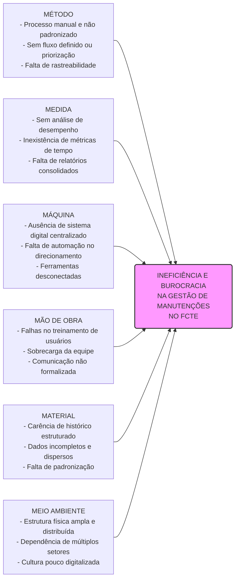
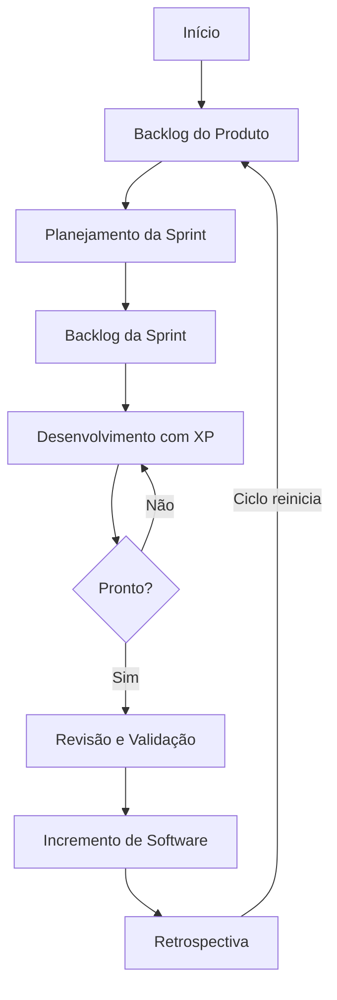

# Visão do Produto e do Projeto

## 1. Visão Geral do Produto

### 1.1 Problema
A Faculdade de Ciências e Tecnologias em Engenharia da Universidade de Brasília (UnB-FCTE) conta com uma ampla infraestrutura de laboratórios, salas de aula, equipamentos de uso intensivo e demais instalações. Para garantir o pleno funcionamento do campus, manutenções preventivas e corretivas são exigidas constantemente. 

Atualmente, o fluxo para reportar defeitos, requisitar manutenções, alocar técnicos e monitorar o status dos consertos baseia-se em processos manuais, registros físicos e comunicações fragmentadas, gerando ineficiência e descentralização. A ausência de um canal padronizado ocasiona desorganização, resultando em chamados duplicados, perda de dados e lentidão na resposta e na execução. Com isso, o solicitante não consegue acompanhar o andamento do seu pedido, enquanto os gestores não têm informações sistematizadas sobre as operações.

#### Diagrama de Ishikawa (Causa e Efeito)

### 1.2 Declaração de Posição do Produto
O **Keep UnB** visa preencher a lacuna tecnológica na gestão de infraestrutura acadêmica, oferecendo uma plataforma ágil e focada na transparência entre a comunidade acadêmica e a equipe de manutenção.

| Campo | Descrição |
| :--- | :--- |
| **Para:** | Frequentadores da UnB - FCTE |
| **Necessidade:** | Reparo frequente de espaços e equipamentos com dificuldades de acesso aos canais de solicitação e acompanhamento vigentes. |
| **O Produto:** | Aplicação Web, nomeada **Keep UnB**. |
| **Que:** | Centraliza e automatiza as solicitações, permitindo o gerenciamento e acompanhamento dos processos em tempo real. |
| **Ao contrário:** | Do modelo vigente (solicitações descentralizadas por e-mail à Cmeq), onde pedidos podem ser perdidos ou passar despercebidos. |
| **Nosso produto:** | Permitirá a criação de solicitações automatizadas e a visualização dos processos em uma interface agradável, acessível e concisa. |

### 1.3 Objetivos do Produto
* **Objetivo Principal:** Entregar uma plataforma web funcional que centralize e automatize a gestão de solicitações de manutenção da FCTE, substituindo o modelo atual descentralizado baseado em e-mails e processos manuais.
* **Objetivos Secundários:**
    * Proporcionar o acompanhamento dos chamados em tempo real pelo solicitante.
    * Organizar e priorizar a fila de manutenções de forma estruturada para a equipe técnica.
    * Gerar dados concretos de desempenho por meio de um painel de indicadores para embasamento de decisões gestoras.
    * Reduzir a dependência de comunicações informais, promovendo um fluxo ao mesmo tempo padronizado e auditável.

### 1.4 Tecnologias Utilizadas
* **Backend:** Python + FastAPI
* **Banco de Dados:** PostgreSQL
* **Frontend:** Next.js (baseado em React)
* **Controle de Versão e CI/CD:** GitHub e GitHub Actions
* **Integração Front/Back:** HTTPS/REST com JSON
* **Metodologia:** ScrumXP (abordagem iterativa/incremental)

---

## 2. Visão Geral do Projeto

### 2.1 Ciclo de Vida do Projeto
O projeto adotará um ciclo de vida iterativo e incremental fundado em métodos ágeis, utilizando **Scrum** para a gestão das Sprints (planejamento, acompanhamento, revisão e retrospectiva) combinado com práticas de **Extreme Programming (XP)** (refatoração e melhoria contínua do código) para assegurar a qualidade.

### 2.2 Organização da Equipe
| Papel | Atribuições | Responsável | Participantes |
| :--- | :--- | :--- | :--- |
| **Dono do Produto** | Escopo do produto, gestão do backlog, tomada de decisões, validação de entregas. | Felipe Melo | Felipe Melo |
| **Scrum Master** | Framework ágil, remoção de impedimentos, facilitação de cerimônias, mentoria. | Arthur Mariani | Arthur Mariani |
| **Arquiteto de Software** | Estrutura do sistema, escolha de tecnologias, escalabilidade, padrões técnicos. | Carlos Costa | Carlos Costa |
| **Dev Backend** | Lógica de negócios, banco de dados, criação de APIs, segurança. | Felipe Melo | Carlos Costa, Felipe Melo, Arthur Mariani, Charles Ruan, Daniel Carneiro |
| **Dev Frontend (UX/UI)** | Protótipos, design de interfaces, pesquisa com usuários, usabilidade e acessibilidade. | Caio Nápoles | Daniel Velloso, Caio Nápoles |
| **Dev Frontend (Integração)**| Implementação da interface visual, consumo de APIs, responsividade. | Arthur Coelho | Arthur Coelho, Rodrigo Barbosa |
| **Analista de Qualidade** | Testes manuais e automatizados, identificação de bugs, estabilidade. | Rodrigo Barbosa | Arthur Mariani, Rodrigo Barbosa |
| **Analista de Requisitos** | Levantamento de necessidades, especificações técnicas, manuais, mapeamento. | Guilherme Souza | Daniel Ribeiro, Guilherme Souza |
| **Engenheiro de Dados** | Modelagem de dados, pipelines (ETL), integração, otimização de consultas. | Pietro Ritchele | Carlos, Daniel Ribeiro, Pietro |
| **Cliente** | Validar requisitos e entregas, fornecer feedback, representar as necessidades. | Daniel Ribeiro | Daniel Ribeiro, Charles Ruan |

### 2.3 Planejamento das Sprints
| Sprint | Entrega / Produto | Início | Fim | Responsáveis / Entregável | Conclusão |
| :---: | :--- | :---: | :---: | :--- | :---: |
| **0** | Estudo do produto | 04/05/2026 | 11/05/2026 | PO, Requisitos, Arquitetura, Dados / Base de Conhecimento | 100% |
| **1** | Definição do Produto | 11/05/2026 | 18/05/2026 | PO, Requisitos / Documento de Visão | 100% |
| **2** | Planejamento da Arquitetura | 18/05/2026 | 25/05/2026 | Arquitetura, Dados, Requisitos / Documento de Arquitetura | 100% |
| **3** | Base para o projeto | 25/05/2026 | 31/05/2026 | Backend, Frontend, Qualidade / Base sólida de desenvolvimento | 5% |

### 2.4 Matriz de Comunicação
* **Gestão Operacional (Contínua/Diária):** Equipe do projeto via Quadro Kanban e Dashboard de Tasks no Notion.
* **Alinhamento Técnico (Semanal):** Reuniões de Daily/Weekly gerando Atas de Reunião e Cronograma atualizado.
* **Acompanhamento de Riscos e Indicadores (Quinzenal):** Relatório de Situação do Projeto com a equipe.
* **Comunicação da Situação (Semanal):** Relatório de Situação e artefatos apresentados ao Professor e Monitor.

### 2.5 Gerenciamento de Riscos Principais
1. **Saída de membro-chave (Exposição Alta):** Mitigação através de pareamento (*pair programming*) e documentação. Contingência foca na redistribuição interna e revisão de escopo com o orientador.
2. **Atraso em funcionalidade crítica (Exposição Alta):** Mitigação por meio de Sprints curtas e backlog priorizado. Contingência prevê entrega de MVP e registro de débito técnico.
3. **Dificuldade técnica com a Stack (Exposição Alta):** Mitigação por estudos dirigidos e *pair programming*. Contingência foca na simplificação da arquitetura ou adoção de alternativa já dominada pela equipe para garantir o MVP.

---

## 3. Declaração de Escopo e Backlog

Os requisitos do produto foram identificados via técnicas de *brainstorm* interno e observação do fluxo atual de e-mails, sendo priorizados utilizando a metodologia MoSCoW.

### 3.1 Perfis de Acesso
* **R01 - Administrador:** Gestão técnica e de contas. Permissão para gerenciar usuários e configurações.
* **R02 - Usuário Solicitante:** Comunidade acadêmica. Permissão para abrir, acompanhar e avaliar solicitações.
* **R03 - Técnico:** Executores. Permissão para visualizar a fila de trabalho e atualizar status de chamados.
* **R04 - Gerente:** Supervisão e análise. Permissão para monitorar métricas, gerar relatórios e delegar tarefas.

### 3.2 Tabela do Backlog do Produto
| Cód. | Sprint | Requisito | Tipo | Prioridade | Descrição / User Story Associada |
| :---: | :---: | :--- | :---: | :---: | :--- |
| **C05/R01** | 3 | CRUD de Usuários | Funcional | Must | Cadastro, edição e exclusão de contas. *"Como administrador, quero gerenciar usuários para controlar o acesso ao sistema."* |
| **C01/R02** | 3 | Registro de Solicitação | Funcional | Must | Cadastro de chamado por local, descrição e categoria. *"Como solicitante, quero registrar um chamado para encaminhá-lo ao técnico."* |
| **C05/R02** | 3 | Autenticação | Funcional | Must | Controle de acesso seguro restringindo funções por perfil. *"Como administrador, quero controlar o acesso por perfil."* |
| **C01/R04** | 3 | Interface Inicial | Não Funcional | Must | Interface web responsiva, acessível e intuitiva. *"Como usuário, quero uma interface clara para utilizar o sistema."* |
| **C01/R03** | A plan. | CRUD de Solicitações | Funcional | Must | Gerenciamento de chamados ativos pelo solicitante. |
| **C02/R01** | A plan. | Acompanhamento | Funcional | Must | Exibição em tempo real do status e histórico de atualizações do chamado. |
| **C03/R01** | A plan. | Fila de Chamados | Funcional | Must | Exibição de tarefas atribuídas ao técnico ordenadas por prioridade. |
| **C03/R02** | A plan. | Atualização de Status | Funcional | Must | Alteração do estado (em andamento, concluído) pelo executor técnico. |
| **C04/R01** | A plan. | Painel de Indicadores | Funcional | Should | Painel com métricas de volume, tempo médio e categorias de chamados. |
| **C04/R02** | A plan. | Geração de Relatórios | Funcional | Should | Mecanismo para exportação de dados gerenciais em formato PDF. |

---

## 4. Métricas e Medições (Abordagem GQM)

### Objetivo 1: Andamento do Projeto e Produtividade
* **Questão:** A equipe está conseguindo entregar o escopo planejado na Sprint dentro do prazo?
* **Métrica:** Velocidade da Sprint (*Sprint Velocity*).
* **Forma de Cálculo:**
  * **Fórmula:** (Somatório dos Story Points concluídos / Somatório dos Story Points planejados na Sprint) × 100
* **Meta:** Entre 90% e 100% de conclusão a cada Sprint. Valores menores disparam análise de gargalos no replanejamento.

### Objetivo 2: Qualidade do Software
* **Questão:** Qual é a densidade de falhas e defeitos nas funcionalidades entregues?
* **Métrica:** Taxa de Resolução de Defeitos (*Bug Resolution Rate*).
* **Forma de Cálculo:**
  * **Fórmula:** (Número de defeitos corrigidos / Número de defeitos reportados) × 100
* **Meta:** 0% de bugs críticos em produção; no mínimo 80% de resolução para falhas comuns na mesma Sprint.

### Objetivo 3: Controle de Débito Técnico
* **Questão:** O código possui cobertura suficiente para evitar regressões e garantir segurança?
* **Métrica:** Cobertura de Código (*Code Coverage*).
* **Forma de Cálculo:**
  * **Fórmula:** (Linhas de código executadas pelos testes / Total de linhas de código do sistema) × 100
* **Meta:** Mínimo de 80% de cobertura de testes automatizados. *Pull Requests* abaixo dessa meta são bloqueados no CI.

---

## 5. Estratégia e Roteiro de Testes

### 5.1 Diretrizes de Execução

* **Níveis de Teste:** Testes unitários (componentes isolados), testes de integração (comunicação Next.js -> FastAPI).
  * **Testes Unitários:** Validação isolada de funções, regras de negócio e componentes visuais.
  * **Testes de Integração:** Validação da comunicação entre o Frontend (Next.js) e as rotas REST do Backend (FastAPI / PostgreSQL).
  * **Testes de Sistema:** Validação ponta a ponta de todos os fluxos de solicitação do sistema.
* **Tipos de Teste:** Execução prioritária de testes funcionais (para garantir os requisitos do sistema) e testes não funcionais (focados em usabilidade e responsividade para dispositivos móveis).
* **Ambiente de Testes:** Execução automatizada integrada ao fluxo de CI/CD (GitHub Actions), rodando obrigatoriamente no ambiente de homologação/desenvolvimento antes de qualquer merge para a branch principal de produção.
* **Forma de Análise:** Avaliação quantitativa e binária baseada no sucesso de execução (Passa / Falha). O teste só é considerado aprovado quando o resultado previsto for rigorosamente igual ao realizado.

### 5.2 Roteiro Base de Casos de Teste
| ID | Caso de Teste | Objetivo do Teste | Nível | Tipo |
| :---: | :--- | :--- | :---: | :---: |
| **CT-01** | Criar Solicitação de Manutenção | Validar se o usuário consegue abrir um chamado. | Sistema | Funcional |
| **CT-02** | Validação de Campos Obrigatórios | Evitar o envio de formulários e solicitações em branco. | Unitário | Funcional |
| **CT-03** | Responsividade da Tabela | Garantir que as tabelas de chamados se adaptem a telas de celulares. | Sistema | Não Funcional |
| **CT-04** | Atualização de Status por Técnico | Validar se o técnico consegue mover o chamado na fila de trabalho. | Integração | Funcional |

---

## 6. Referências Bibliográficas

1. BECK, Kent; ANDRES, Cynthia. **Extreme programming explained: embrace change**. 2. ed. Boston: Addison-Wesley, 2004.
2. WASHIZAKI, Hironori (ed.). **Guide to the software engineering body of knowledge (SWEBOK Guide): version 4.0**. Los Alamitos: IEEE Computer Society, 2024. Disponível em: <https://www.swebok.org>.

---

!!! tip
    Caso prefira, você pode [abrir o Documento de Visão em formato PDF diretamente](./visao_parnas.pdf), ou [baixar versão no formato _.docx_](./visao_parnas.docx).
